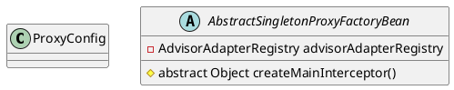

org.springframework.aop.framework.AbstractSingletonProxyFactoryBean

## hierarchy
```
ProxyConfig (org.springframework.aop.framework)
    AbstractSingletonProxyFactoryBean (org.springframework.aop.framework)
        TransactionProxyFactoryBean (org.springframework.transaction.interceptor)
        CacheProxyFactoryBean (org.springframework.cache.interceptor)
```

## define

