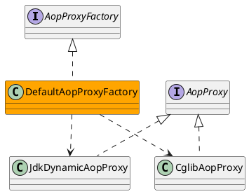

org.springframework.aop.framework.AopProxyFactory

## hierarchy
```
AopProxyFactory (org.springframework.aop.framework)
    DefaultAopProxyFactory (org.springframework.aop.framework)
```

## define


```java
public interface AopProxyFactory {
    
	AopProxy createAopProxy(AdvisedSupport config) throws AopConfigException;

}

public class DefaultAopProxyFactory implements AopProxyFactory, Serializable {

	@Override
	public AopProxy createAopProxy(AdvisedSupport config) throws AopConfigException {
		if (config.isOptimize() || config.isProxyTargetClass() || hasNoUserSuppliedProxyInterfaces(config)) {
			Class<?> targetClass = config.getTargetClass();
			if (targetClass == null) {
				throw new AopConfigException("TargetSource cannot determine target class: " +
						"Either an interface or a target is required for proxy creation.");
			}
			if (targetClass.isInterface() || Proxy.isProxyClass(targetClass)) { // 接口
				return new JdkDynamicAopProxy(config);
			}
			return new ObjenesisCglibAopProxy(config);
		}
		else {
			return new JdkDynamicAopProxy(config);
		}
	}

	/**
	 * Determine whether the supplied {@link AdvisedSupport} has only the
	 * {@link org.springframework.aop.SpringProxy} interface specified
	 * (or no proxy interfaces specified at all).
	 */
	private boolean hasNoUserSuppliedProxyInterfaces(AdvisedSupport config) {
		Class<?>[] ifcs = config.getProxiedInterfaces();
		return (ifcs.length == 0 || (ifcs.length == 1 && SpringProxy.class.isAssignableFrom(ifcs[0])));
	}

}
```