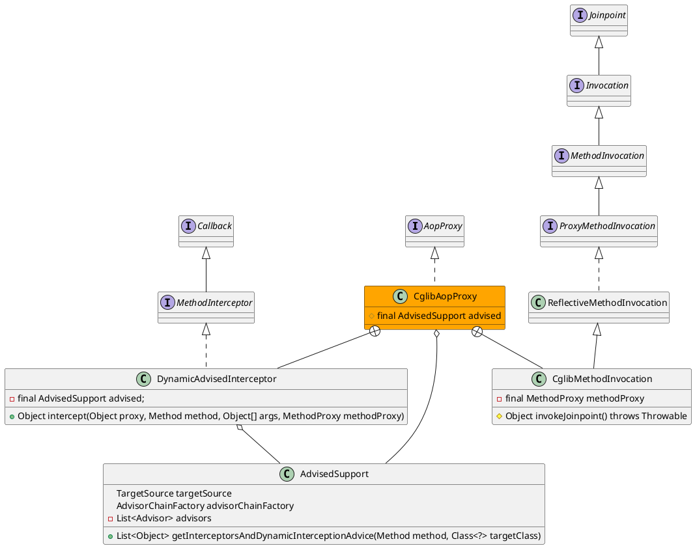

org.springframework.aop.framework.CglibAopProxy

## hierarchy
```
AopProxy (org.springframework.aop.framework)
    JdkDynamicAopProxy (org.springframework.aop.framework)
    CglibAopProxy (org.springframework.aop.framework)
        ObjenesisCglibAopProxy (org.springframework.aop.framework)
```

## define
* 内部类
  * DynamicAdvisedInterceptor cglib的拦截器，顶层是回调接口，与aopalliance的Advice类似
  * CglibMethodInvocation Invocation本质上是Jointpoint



## inner class

### DynamicAdvisedInterceptor
* 获得拦截器链 advised.getInterceptorsAndDynamicInterceptionAdvice(method, targetClass)
 - 拦截器链为空，直接调用
 - 拦截器链不为空，执行拦截器链
* 结果处理、返回

```java
	private static class DynamicAdvisedInterceptor implements MethodInterceptor, Serializable {

		private final AdvisedSupport advised;

		public DynamicAdvisedInterceptor(AdvisedSupport advised) {
			this.advised = advised;
		}

		@Override
		public Object intercept(Object proxy, Method method, Object[] args, MethodProxy methodProxy) throws Throwable {
			Object oldProxy = null;
			boolean setProxyContext = false;
			Class<?> targetClass = null;
			Object target = null;
			try {
				if (this.advised.exposeProxy) {
					// Make invocation available if necessary.
					oldProxy = AopContext.setCurrentProxy(proxy); // Aop上下文保存了代理对象
					setProxyContext = true;
				}
				// May be null. Get as late as possible to minimize the time we
				// "own" the target, in case it comes from a pool...
				target = getTarget();
				if (target != null) {
					targetClass = target.getClass();
				}
				List<Object> chain = this.advised.getInterceptorsAndDynamicInterceptionAdvice(method, targetClass);
				Object retVal;
				// Check whether we only have one InvokerInterceptor: that is,
				// no real advice, but just reflective invocation of the target.
				if (chain.isEmpty() && Modifier.isPublic(method.getModifiers())) {
					// We can skip creating a MethodInvocation: just invoke the target directly.
					// Note that the final invoker must be an InvokerInterceptor, so we know
					// it does nothing but a reflective operation on the target, and no hot
					// swapping or fancy proxying.
					Object[] argsToUse = AopProxyUtils.adaptArgumentsIfNecessary(method, args);
					retVal = methodProxy.invoke(target, argsToUse);
				}
				else {
					// We need to create a method invocation...
					retVal = new CglibMethodInvocation(proxy, target, method, args, targetClass, chain, methodProxy).proceed(); // 方法调用器
				}
				retVal = processReturnType(proxy, target, method, retVal);
				return retVal;
			}
			finally {
				if (target != null) {
					releaseTarget(target);
				}
				if (setProxyContext) {
					// Restore old proxy.
					AopContext.setCurrentProxy(oldProxy);
				}
			}
		}
	}
```