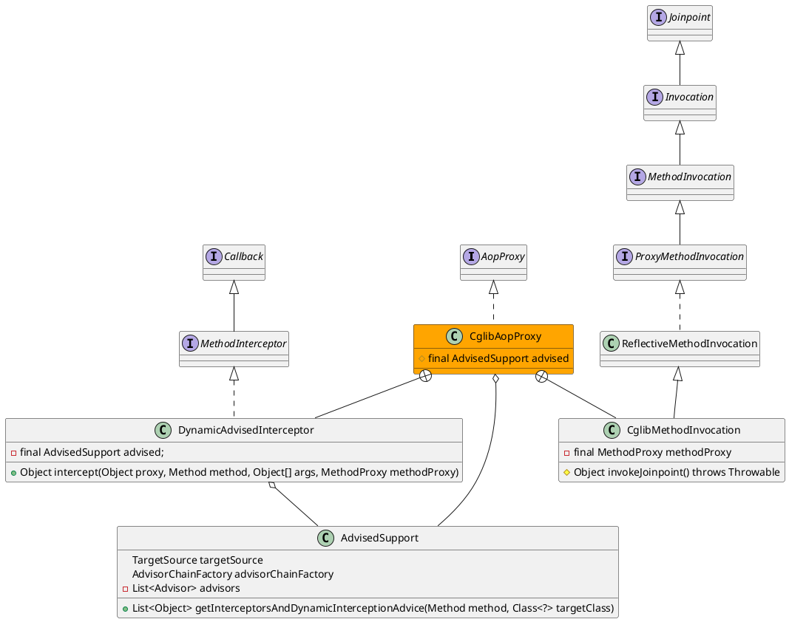

org.springframework.aop.framework.CglibAopProxy

## hierarchy
```
AopProxy (org.springframework.aop.framework)
    JdkDynamicAopProxy (org.springframework.aop.framework)
    CglibAopProxy (org.springframework.aop.framework)
        ObjenesisCglibAopProxy (org.springframework.aop.framework)
```

## define
* 内部类
  * DynamicAdvisedInterceptor cglib的拦截器，顶层是回调接口，与aopalliance的Advice类似
  * CglibMethodInvocation Invocation本质上是Jointpoint



## DynamicAdvisedInterceptor.intercept()
* 获得拦截器链 advised.getInterceptorsAndDynamicInterceptionAdvice(method, targetClass)
 - 拦截器链为空，直接调用
 - 拦截器链不为空，执行拦截器链
* 结果处理、返回