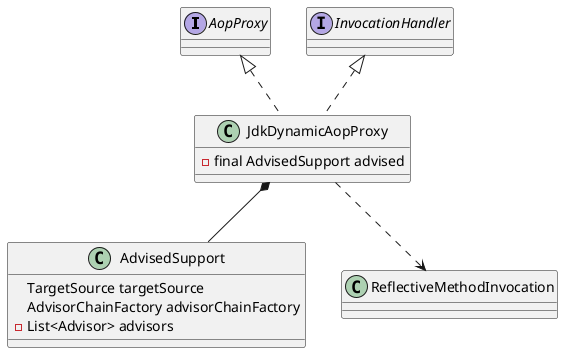
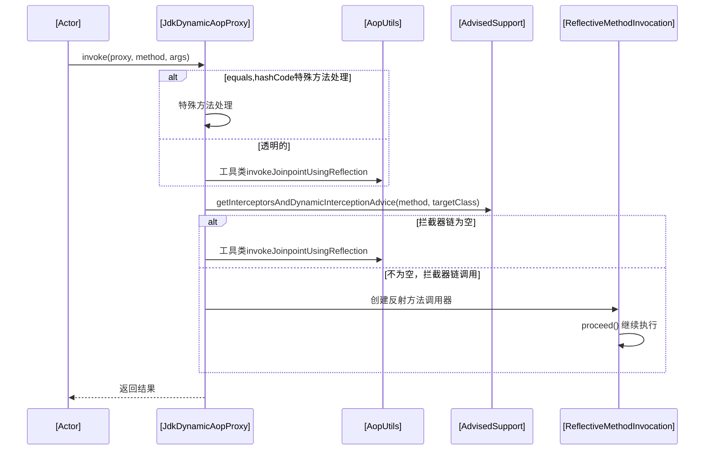

org.springframework.aop.framework.JdkDynamicAopProxy

## define


```java
final class JdkDynamicAopProxy implements AopProxy, InvocationHandler, Serializable {
	private final AdvisedSupport advised;
	private boolean equalsDefined;
	private boolean hashCodeDefined;
}
```


## methods

## getProxy
```java
	@Override
	public Object getProxy() {
		return getProxy(ClassUtils.getDefaultClassLoader());
	}

	@Override
	public Object getProxy(@Nullable ClassLoader classLoader) {
		if (logger.isDebugEnabled()) {
			logger.debug("Creating JDK dynamic proxy: target source is " + this.advised.getTargetSource());
		}
		Class<?>[] proxiedInterfaces = AopProxyUtils.completeProxiedInterfaces(this.advised, true);
		findDefinedEqualsAndHashCodeMethods(proxiedInterfaces);
		return Proxy.newProxyInstance(classLoader, proxiedInterfaces, this);
	}
```

### invoke
1. 特殊方法处理
2. 获得拦截器链
    - 拦截器为空，直接调用
    - 拦截器不为空，执行拦截器链
3. 结果处理、返回



```java
	@Override
	@Nullable
	public Object invoke(Object proxy, Method method, Object[] args) throws Throwable {
		MethodInvocation invocation;
		Object oldProxy = null;
		boolean setProxyContext = false;

		TargetSource targetSource = this.advised.targetSource;
		Object target = null;

		try {
			if (!this.equalsDefined && AopUtils.isEqualsMethod(method)) {
				// The target does not implement the equals(Object) method itself.
				return equals(args[0]);
			}
			else if (!this.hashCodeDefined && AopUtils.isHashCodeMethod(method)) {
				// The target does not implement the hashCode() method itself.
				return hashCode();
			}
			else if (method.getDeclaringClass() == DecoratingProxy.class) {
				// There is only getDecoratedClass() declared -> dispatch to proxy config.
				return AopProxyUtils.ultimateTargetClass(this.advised);
			}
			else if (!this.advised.opaque && method.getDeclaringClass().isInterface() &&
					method.getDeclaringClass().isAssignableFrom(Advised.class)) {
				// Service invocations on ProxyConfig with the proxy config...
				return AopUtils.invokeJoinpointUsingReflection(this.advised, method, args);
			}

			Object retVal;

			if (this.advised.exposeProxy) {
				// Make invocation available if necessary.
				oldProxy = AopContext.setCurrentProxy(proxy);
				setProxyContext = true;
			}

			// Get as late as possible to minimize the time we "own" the target,
			// in case it comes from a pool.
			target = targetSource.getTarget();
			Class<?> targetClass = (target != null ? target.getClass() : null);

			// Get the interception chain for this method.
			List<Object> chain = this.advised.getInterceptorsAndDynamicInterceptionAdvice(method, targetClass);

			// Check whether we have any advice. If we don't, we can fallback on direct
			// reflective invocation of the target, and avoid creating a MethodInvocation.
			if (chain.isEmpty()) {
				// We can skip creating a MethodInvocation: just invoke the target directly
				// Note that the final invoker must be an InvokerInterceptor so we know it does
				// nothing but a reflective operation on the target, and no hot swapping or fancy proxying.
				Object[] argsToUse = AopProxyUtils.adaptArgumentsIfNecessary(method, args);
				retVal = AopUtils.invokeJoinpointUsingReflection(target, method, argsToUse);
			}
			else {
				// We need to create a method invocation...
				invocation = new ReflectiveMethodInvocation(proxy, target, method, args, targetClass, chain);
				// Proceed to the joinpoint through the interceptor chain.
				retVal = invocation.proceed();
			}

			// Massage return value if necessary.
			Class<?> returnType = method.getReturnType();
			if (retVal != null && retVal == target &&
					returnType != Object.class && returnType.isInstance(proxy) &&
					!RawTargetAccess.class.isAssignableFrom(method.getDeclaringClass())) {
				// Special case: it returned "this" and the return type of the method
				// is type-compatible. Note that we can't help if the target sets
				// a reference to itself in another returned object.
				retVal = proxy;
			}
			else if (retVal == null && returnType != Void.TYPE && returnType.isPrimitive()) {
				throw new AopInvocationException(
						"Null return value from advice does not match primitive return type for: " + method);
			}
			return retVal;
		}
		finally {
			if (target != null && !targetSource.isStatic()) {
				// Must have come from TargetSource.
				targetSource.releaseTarget(target);
			}
			if (setProxyContext) {
				// Restore old proxy.
				AopContext.setCurrentProxy(oldProxy);
			}
		}
	}
```