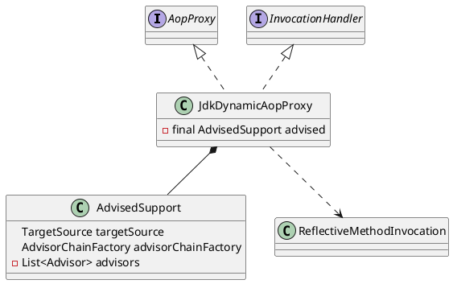
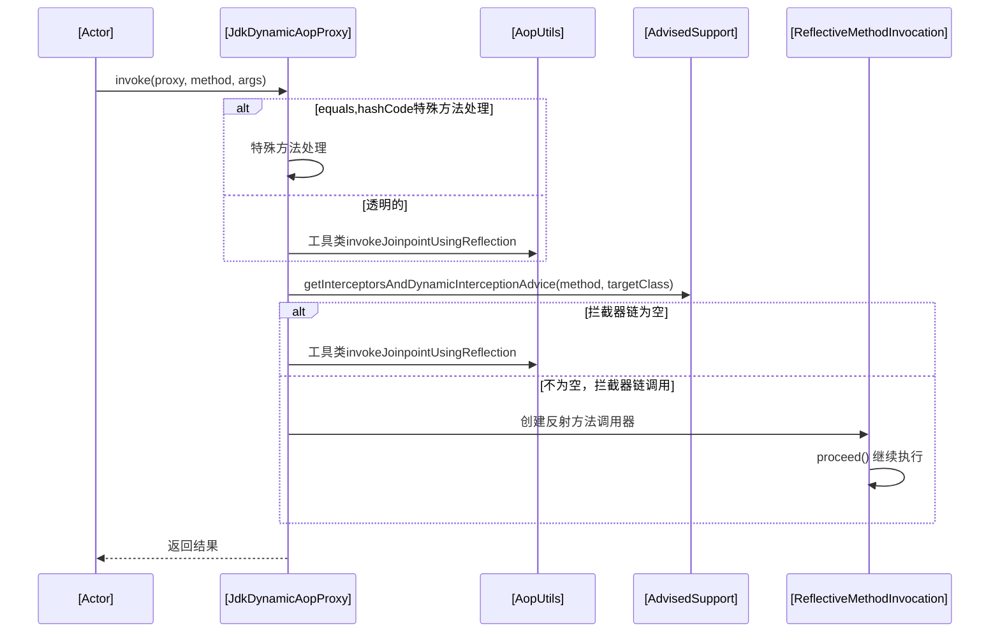

org.springframework.aop.framework.JdkDynamicAopProxy

## define


```java
final class JdkDynamicAopProxy implements AopProxy, InvocationHandler, Serializable {
}
```


## methods

## getProxy
```java
	@Override
	public Object getProxy() {
		return getProxy(ClassUtils.getDefaultClassLoader());
	}

	@Override
	public Object getProxy(@Nullable ClassLoader classLoader) {
		if (logger.isDebugEnabled()) {
			logger.debug("Creating JDK dynamic proxy: target source is " + this.advised.getTargetSource());
		}
		Class<?>[] proxiedInterfaces = AopProxyUtils.completeProxiedInterfaces(this.advised, true);
		findDefinedEqualsAndHashCodeMethods(proxiedInterfaces);
		return Proxy.newProxyInstance(classLoader, proxiedInterfaces, this);
	}
```

### invoke
1. 特殊方法处理
2. 获得拦截器链
    - 拦截器为空，直接调用
    - 拦截器不为空，执行拦截器链
3. 结果处理、返回

