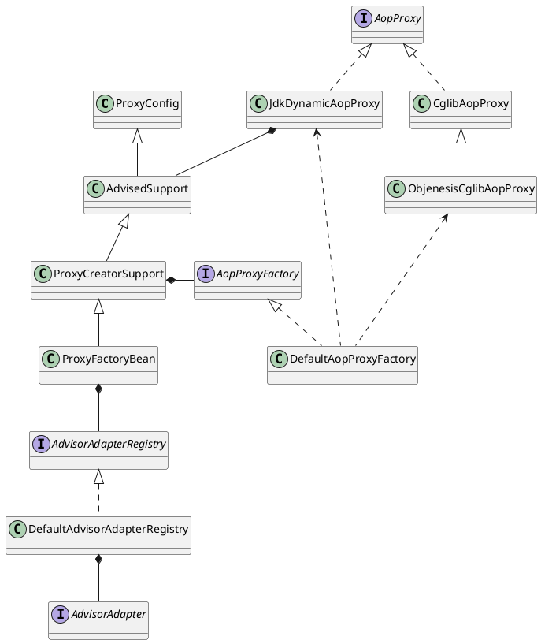
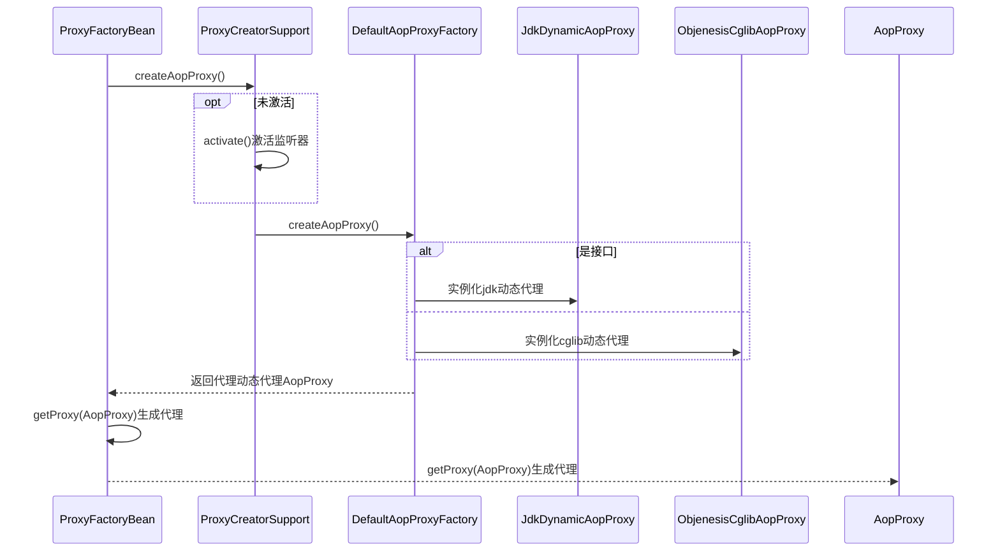

org.springframework.aop.framework.ProxyFactoryBean

## hierarchy
```
ProxyConfig (org.springframework.aop.framework)
    AdvisedSupport (org.springframework.aop.framework)
        ProxyCreatorSupport (org.springframework.aop.framework)
            ProxyFactoryBean (org.springframework.aop.framework)
```

## define


## 1. ProxyFactoryBean 类图
```yuml
// {type:class}

[AdvisedSupport{bg:thistle}]
[ProxyCreatorSupport{bg:thistle}]

// 1. 代理配置基类
[ProxyConfig]^-[AdvisedSupport]

// 2. 已被通知的支持
[Advised]^-.-[AdvisedSupport]
[TargetClassAware]^-[Advised]

// Advised包括拦截器、通知器的集合、已经代理的接口的数组
[Advised]<>-[Advisor]

// 3. 代理创建支持
[AdvisedSupport]^-[ProxyCreatorSupport]

// 代理创建支持类，持有aop代理工厂，构造时有DefaultAopProxyFactory
[ProxyCreatorSupport]++-[AopProxyFactory]
[ProxyCreatorSupport]++-[AdvisedSupportListener]

// 4.1 代理工厂
[ProxyCreatorSupport]^-[ProxyFactory]
[ProxyCreatorSupport]^-[AspectJProxyFactory]

// 4.2 代理工程bean
[ProxyCreatorSupport]^-[ProxyFactoryBean]

[FactoryBean]^-.-[ProxyFactoryBean]
[BeanClassLoaderAware]^-.-[ProxyFactoryBean]
[BeanFactoryAware]^-.-[ProxyFactoryBean]

```

## 2. 生成AOP代理
* 实例化切面链
* 判断是不是单例类型，是单例，获得单例实例
* 不是单例，获得原型实例

### 2.1 ProxyFactoryBean.getObject()
```mermaid
sequenceDiagram
   Actor->>ProxyFactoryBean:getObject()
   
   %% 1. 第一次使用时初始化
   ProxyFactoryBean->>ProxyFactoryBean:initializeAdvisorChain()
   
   %% 2. 是不是单例
   opt isSingleton()
        %% 2.1 单例实例
        ProxyFactoryBean->>ProxyFactoryBean:getSingletonInstance()
        ProxyFactoryBean->>ProxyCreatorSupport:createAopProxy()
        ProxyFactoryBean-->>Actor:返回代理
   end
   
   %% 3. 原型实例
   ProxyFactoryBean->>ProxyFactoryBean:newPrototypeInstance()
   %% 3.1 实例化新的ProxyCreatorSupport
   ProxyFactoryBean->>ProxyCreatorSupport:实例化新的ProxyCreatorSupport()
   ProxyFactoryBean->>ProxyCreatorSupport:createAopProxy()
   ProxyFactoryBean-->>Actor:返回代理
```

### 2.1 DefaultAopProxyFactory.createAopProxy()
org.springframework.aop.framework.DefaultAopProxyFactory



## 3. 动态代理实现

[AopProxy](/docs/20-framework/src/spring/spring-aop/framework/AopProxy.md)