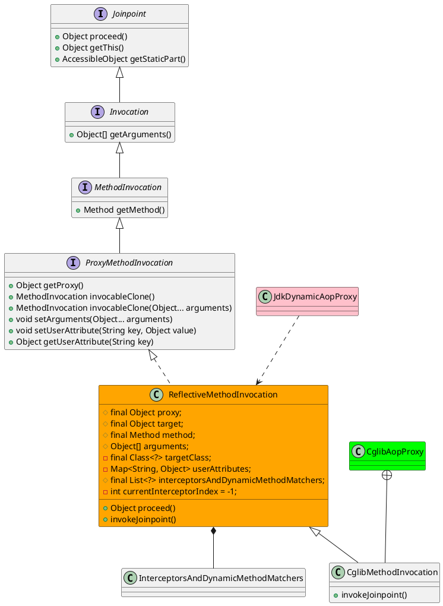

org.springframework.aop.framework.ReflectiveMethodInvocation

## Hierachy
```
Joinpoint (org.aopalliance.intercept)
    Invocation (org.aopalliance.intercept)
        ConstructorInvocation (org.aopalliance.intercept)
        MethodInvocation (org.aopalliance.intercept)
            ProxyMethodInvocation (org.springframework.aop)
                ReflectiveMethodInvocation (org.springframework.aop.framework)
                    CglibMethodInvocation in CglibAopProxy (org.springframework.aop.framework)
```

## Define
* 反射的方法调用器



```java
public class ReflectiveMethodInvocation implements ProxyMethodInvocation, Cloneable {
	protected final Object proxy;
	@Nullable
	protected final Object target;
	protected final Method method;
	protected Object[] arguments;
	@Nullable
	private final Class<?> targetClass;
	@Nullable
	private Map<String, Object> userAttributes;
	protected final List<?> interceptorsAndDynamicMethodMatchers;
	private int currentInterceptorIndex = -1;
}
```

## Methods

### proceed
- 拦截器链
- 匹配判断，决定是否调用拦截器方法

```java
	@Nullable
	public Object proceed() throws Throwable {
		// We start with an index of -1 and increment early.
		if (this.currentInterceptorIndex == this.interceptorsAndDynamicMethodMatchers.size() - 1) {
			return invokeJoinpoint();
		}

		Object interceptorOrInterceptionAdvice =
				this.interceptorsAndDynamicMethodMatchers.get(++this.currentInterceptorIndex);
		if (interceptorOrInterceptionAdvice instanceof InterceptorAndDynamicMethodMatcher) {
			// Evaluate dynamic method matcher here: static part will already have
			// been evaluated and found to match.
			InterceptorAndDynamicMethodMatcher dm =
					(InterceptorAndDynamicMethodMatcher) interceptorOrInterceptionAdvice;
			Class<?> targetClass = (this.targetClass != null ? this.targetClass : this.method.getDeclaringClass());
			if (dm.methodMatcher.matches(this.method, targetClass, this.arguments)) {
				return dm.interceptor.invoke(this);
			}
			else {
				// Dynamic matching failed.
				// Skip this interceptor and invoke the next in the chain.
				return proceed();
			}
		}
		else {
			// It's an interceptor, so we just invoke it: The pointcut will have
			// been evaluated statically before this object was constructed.
			return ((MethodInterceptor) interceptorOrInterceptionAdvice).invoke(this);
		}
	}
```

### invokeJoinpoint
```java
	protected Object invokeJoinpoint() throws Throwable {
		return AopUtils.invokeJoinpointUsingReflection(this.target, this.method, this.arguments);
	}
```