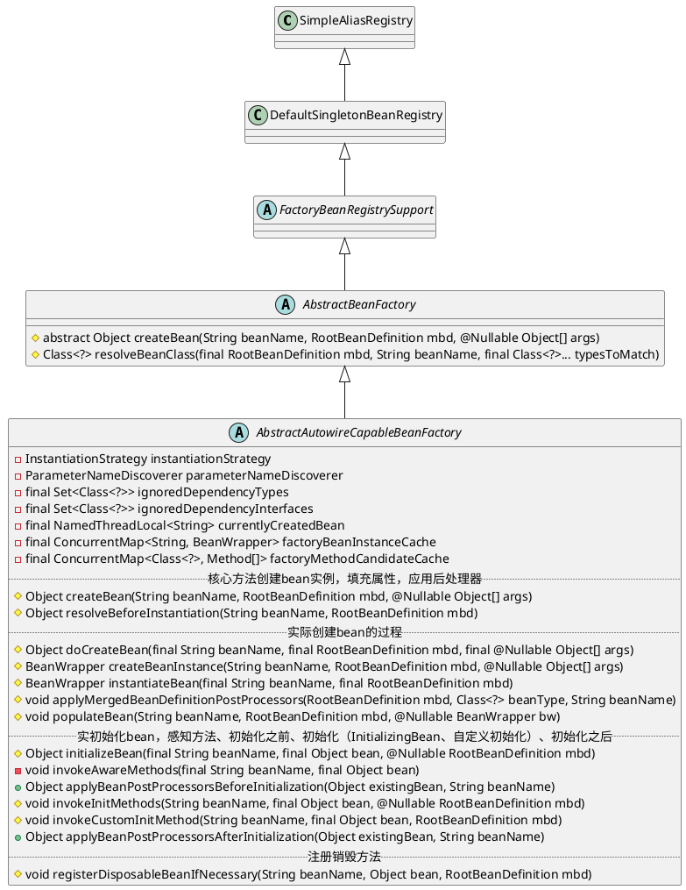
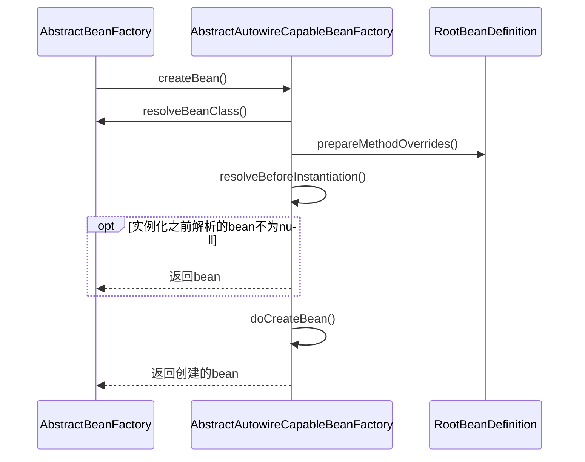
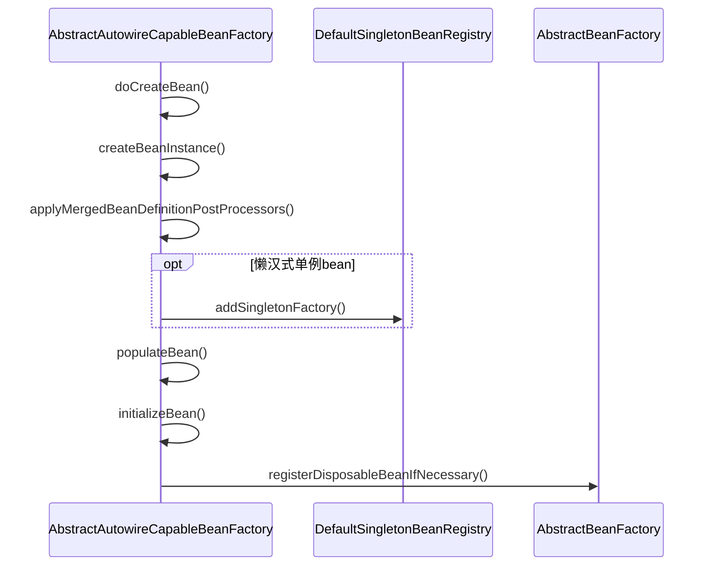
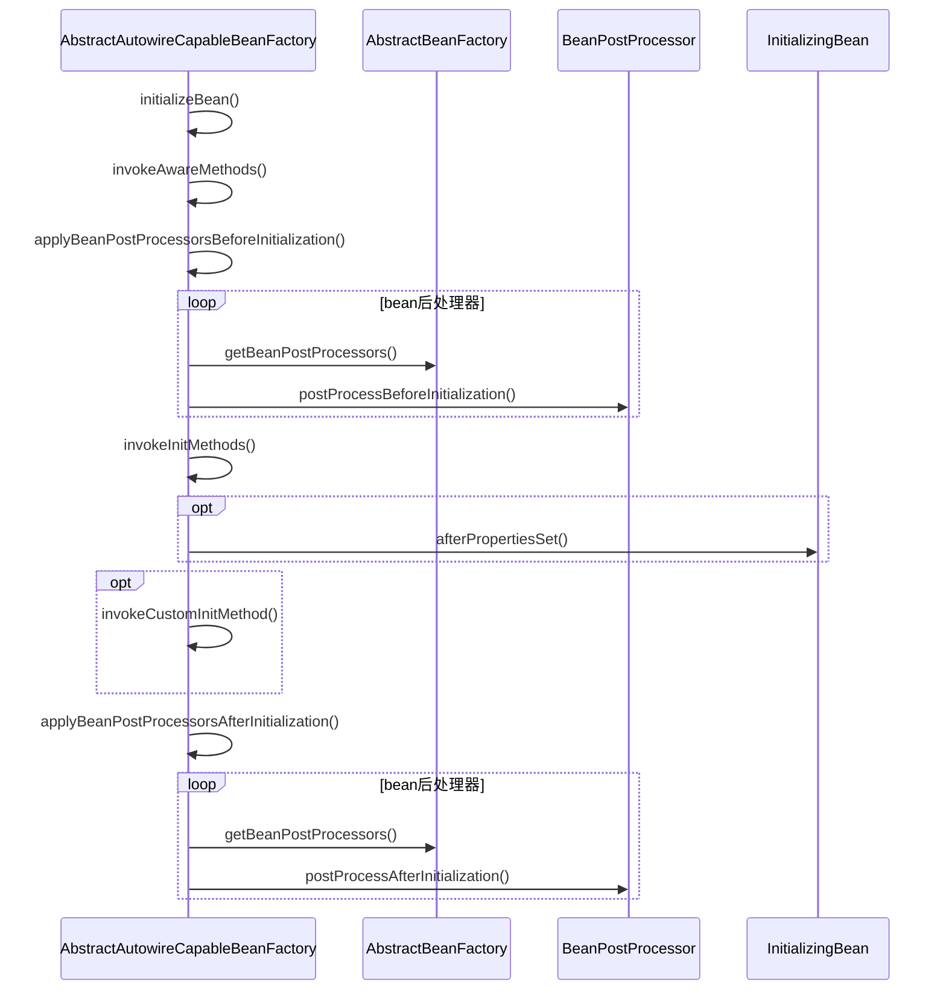

org.springframework.beans.factory.support.AbstractAutowireCapableBeanFactory


## hierarchy
```
SimpleAliasRegistry (org.springframework.core)
    DefaultSingletonBeanRegistry (org.springframework.beans.factory.support)
        FactoryBeanRegistrySupport (org.springframework.beans.factory.support)
            AbstractBeanFactory (org.springframework.beans.factory.support)
                AbstractAutowireCapableBeanFactory (org.springframework.beans.factory.support)
                    DefaultListableBeanFactory (org.springframework.beans.factory.support)
                        XmlBeanFactory (org.springframework.beans.factory.xml)
```

## class



## createBean()
* 解析类 resolveBeanClass
* 准备方法重写 prepareMethodOverrides
* 实例化之前的解析 resolveBeforeInstantiation
* doCreateBean


## doCreateBean()
* 实例化 createBeanInstance 
    + obtainFromSupplier 
    + instantiateUsingFactoryMethod工厂方法实例化 
    + autowireConstructor带参构造 
    + instantiateBean无参构造
* 填充属性 populateBean
* 初始化 initializeBean
    + 调用感知方法
    + 应用后处理器初始化之前方法
    + 调用初始化方法 afterPropertiesSet invokeCustomInitMethod
    + 应用后处理器初始化之前方法
* 注册销毁接口 registerDisposableBeanIfNecessary



## initializeBean()
- 调用感知方法 invokeAwareMethods BeanNameAware BeanClassLoaderAware BeanFactoryAware
- 应用后处理器初始化之前方法 applyBeanPostProcessorsBeforeInitialization 循环遍历 postProcessBeforeInitialization
- 调用初始化方法 invokeInitMethods
    + 初始化中的bean InitializingBean.afterPropertiesSet()
    + 调用自定义初始化方法 invokeCustomInitMethod
- 应用后处理器初始化之前方法 applyBeanPostProcessorsAfterInitialization 循环遍历 postProcessAfterInitialization


