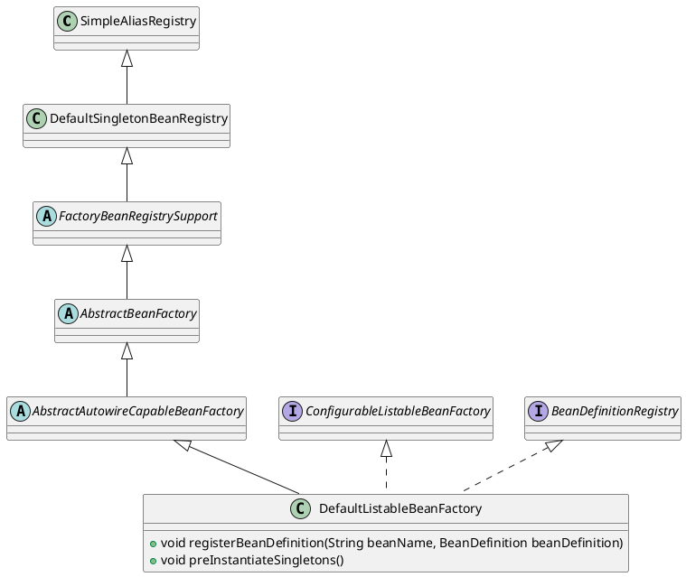
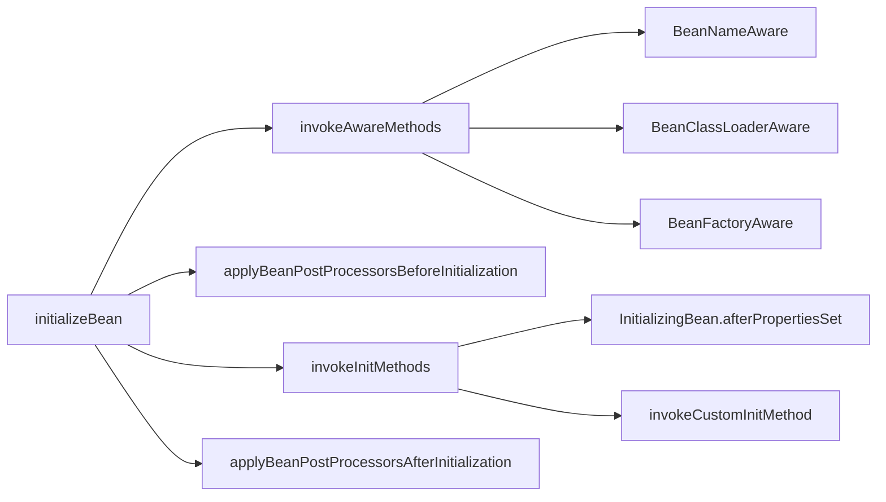

org.springframework.beans.factory.support.DefaultListableBeanFactory

## Hierarchy
```
SimpleAliasRegistry
    DefaultSingletonBeanRegistry
        FactoryBeanRegistrySupport
            AbstractBeanFactory
                AbstractAutowireCapableBeanFactory
                    DefaultListableBeanFactory
```

## Define



```java
public class DefaultListableBeanFactory extends AbstractAutowireCapableBeanFactory
		implements ConfigurableListableBeanFactory, BeanDefinitionRegistry, Serializable {
    
    /** Map of bean definition objects, keyed by bean name. */
    private final Map<String, BeanDefinition> beanDefinitionMap = new ConcurrentHashMap<>(256);

    /** Map from bean name to merged BeanDefinitionHolder. */
    private final Map<String, BeanDefinitionHolder> mergedBeanDefinitionHolders = new ConcurrentHashMap<>(256);
}
```

## Methos

### registerBeanDefinition
```java
	@Override
	public void registerBeanDefinition(String beanName, BeanDefinition beanDefinition)
			throws BeanDefinitionStoreException {

		Assert.hasText(beanName, "Bean name must not be empty");
		Assert.notNull(beanDefinition, "BeanDefinition must not be null");

		if (beanDefinition instanceof AbstractBeanDefinition) {
			try {
				((AbstractBeanDefinition) beanDefinition).validate();
			}
			catch (BeanDefinitionValidationException ex) {
				throw new BeanDefinitionStoreException(beanDefinition.getResourceDescription(), beanName,
						"Validation of bean definition failed", ex);
			}
		}

		BeanDefinition existingDefinition = this.beanDefinitionMap.get(beanName);
		if (existingDefinition != null) {
			if (!isAllowBeanDefinitionOverriding()) {
				throw new BeanDefinitionOverrideException(beanName, beanDefinition, existingDefinition);
			}
			else if (existingDefinition.getRole() < beanDefinition.getRole()) {
				// e.g. was ROLE_APPLICATION, now overriding with ROLE_SUPPORT or ROLE_INFRASTRUCTURE
				if (logger.isInfoEnabled()) {
					logger.info("Overriding user-defined bean definition for bean '" + beanName +
							"' with a framework-generated bean definition: replacing [" +
							existingDefinition + "] with [" + beanDefinition + "]");
				}
			}
			else if (!beanDefinition.equals(existingDefinition)) {
				if (logger.isDebugEnabled()) {
					logger.debug("Overriding bean definition for bean '" + beanName +
							"' with a different definition: replacing [" + existingDefinition +
							"] with [" + beanDefinition + "]");
				}
			}
			else {
				if (logger.isTraceEnabled()) {
					logger.trace("Overriding bean definition for bean '" + beanName +
							"' with an equivalent definition: replacing [" + existingDefinition +
							"] with [" + beanDefinition + "]");
				}
			}
			this.beanDefinitionMap.put(beanName, beanDefinition);
		}
		else {
			if (hasBeanCreationStarted()) {
				// Cannot modify startup-time collection elements anymore (for stable iteration)
				synchronized (this.beanDefinitionMap) {
					this.beanDefinitionMap.put(beanName, beanDefinition);
					List<String> updatedDefinitions = new ArrayList<>(this.beanDefinitionNames.size() + 1);
					updatedDefinitions.addAll(this.beanDefinitionNames);
					updatedDefinitions.add(beanName);
					this.beanDefinitionNames = updatedDefinitions;
					removeManualSingletonName(beanName);
				}
			}
			else {
				// Still in startup registration phase
				this.beanDefinitionMap.put(beanName, beanDefinition);
				this.beanDefinitionNames.add(beanName);
				removeManualSingletonName(beanName);
			}
			this.frozenBeanDefinitionNames = null;
		}

		if (existingDefinition != null || containsSingleton(beanName)) {
			resetBeanDefinition(beanName);
		}
		else if (isConfigurationFrozen()) {
			clearByTypeCache();
		}
	}
```


### 依赖注入DI-getBean()

```mermaid
sequenceDiagram
    
    Actor ->> AbstractBeanFactory: getBean()
    AbstractBeanFactory ->> AbstractBeanFactory: doGetBean()
    AbstractBeanFactory ->> DefaultSingletonBeanRegistry: getSingleton()
    AbstractBeanFactory ->> AbstractAutowireCapableBeanFactory: createBean()
    AbstractAutowireCapableBeanFactory ->> AbstractAutowireCapableBeanFactory: doCreateBean()
    AbstractAutowireCapableBeanFactory ->> AbstractAutowireCapableBeanFactory: createBeanInstance()
    AbstractAutowireCapableBeanFactory ->> AbstractAutowireCapableBeanFactory: instantiateUsingFactoryMethod()
```

### 依赖注入
```mermaid
sequenceDiagram
    participant Actor
    participant AbstractBeanFactory
    participant AbstractAutowireCapableBeanFactory

    Actor ->> AbstractBeanFactory: getBean()
    AbstractBeanFactory ->> AbstractBeanFactory: doGetBean()
    AbstractBeanFactory ->> AbstractAutowireCapableBeanFactory: createBean()
    AbstractAutowireCapableBeanFactory ->> AbstractAutowireCapableBeanFactory: doCreateBean()
    AbstractAutowireCapableBeanFactory ->> InstantiationStrategy: instantiate()
    InstantiationStrategy -->> AbstractAutowireCapableBeanFactory: populateBean()
    AbstractAutowireCapableBeanFactory ->> AbstractAutowireCapableBeanFactory: applyPropertyValues()
```

### 初始化bean
