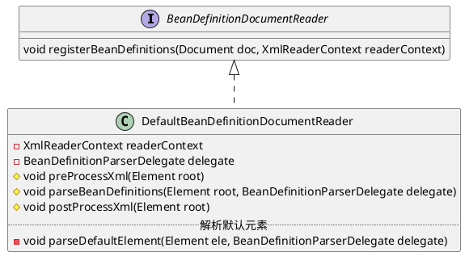

org.springframework.beans.factory.xml.DefaultBeanDefinitionDocumentReader

## define
* parseDefaultElement 解析默认元素
  * importBeanDefinitionResource 解析import
  * processAliasRegistration 处理别名
  * processBeanDefinition 处理bean定义
  * doRegisterBeanDefinitions 递归解析
  
