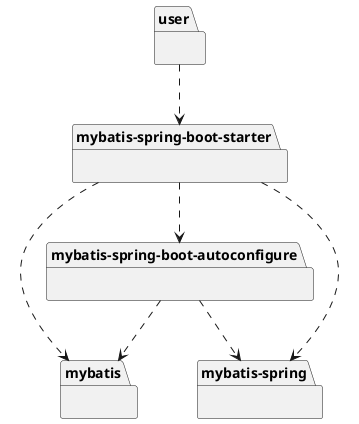

spring.provides

## package
```
spring-boot-starter
spring-boot-starter-activemq
spring-boot-starter-amqp
spring-boot-starter-aop
spring-boot-starter-artemis
spring-boot-starter-batch
spring-boot-starter-cache
spring-boot-starter-cloud-connectors
spring-boot-starter-data-cassandra
spring-boot-starter-data-cassandra-reactive
spring-boot-starter-data-couchbase
spring-boot-starter-data-couchbase-reactive
spring-boot-starter-data-elasticsearch
spring-boot-starter-data-jdbc
spring-boot-starter-data-jpa
spring-boot-starter-data-ldap
spring-boot-starter-data-mongodb
spring-boot-starter-data-mongodb-reactive
spring-boot-starter-data-neo4j
spring-boot-starter-data-redis
spring-boot-starter-data-redis-reactive
spring-boot-starter-data-rest
spring-boot-starter-data-solr
spring-boot-starter-freemarker
spring-boot-starter-groovy-templates
spring-boot-starter-hateoas
spring-boot-starter-integration
spring-boot-starter-jdbc
spring-boot-starter-jersey
spring-boot-starter-jooq
spring-boot-starter-json
spring-boot-starter-jta-atomikos
spring-boot-starter-jta-bitronix
spring-boot-starter-mail
spring-boot-starter-mustache
spring-boot-starter-oauth2-client
spring-boot-starter-oauth2-resource-server
spring-boot-starter-quartz
spring-boot-starter-security
spring-boot-starter-test
spring-boot-starter-thymeleaf
spring-boot-starter-validation
spring-boot-starter-web
spring-boot-starter-web-services
spring-boot-starter-webflux
spring-boot-starter-websocket
```

## custom starter
场景启动器
1.这个场景需要使用的依赖是什么
2.如何编写自动配置类

```
@Configuration // 指定这个类是一个配置类
@ConditionOnXXX // 指定条件成立的情况下自动配置
@AutoConfigureAfter // 指定自动配置类的顺序
@Bean // 给容器中添加组件

@ConfigurationProperties 结构相关xxxProperties来绑定相关配置
@EnableConfigurationProperties 让xxxProperties生效加入到容器中

自动配置类要能加载
将需要启动就加载的自动配置类，配置在META-INF/spring.factories
org.springframework.boot.autoconfigure.EnableAutoConfiguration=\
org.springframework.boot.autoconfigure.web.servlet.WebMvcAutoConfiguration
```

3.模式 
* 启动器模块是一个空jar文件，仅提供辅助性依赖管理，这些依赖管理可能用于自动装配或者其他类库
* 自动配置模块
* 别人只需依赖启动器

命名空间：
- 官方的命名空间 spring-boot-starter-模块名，如spring-boot-starter-web，spring-boot-autoconfigure
- 自定义命名空间 模块名-spring-boot-starter，如mybatis-spring-boot-starter，mybatis-spring-boot-autoconfigure


