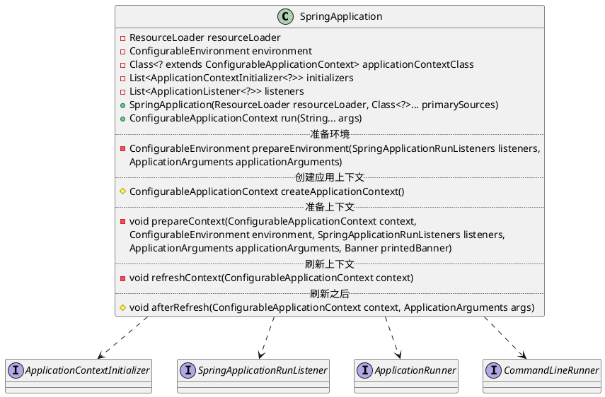
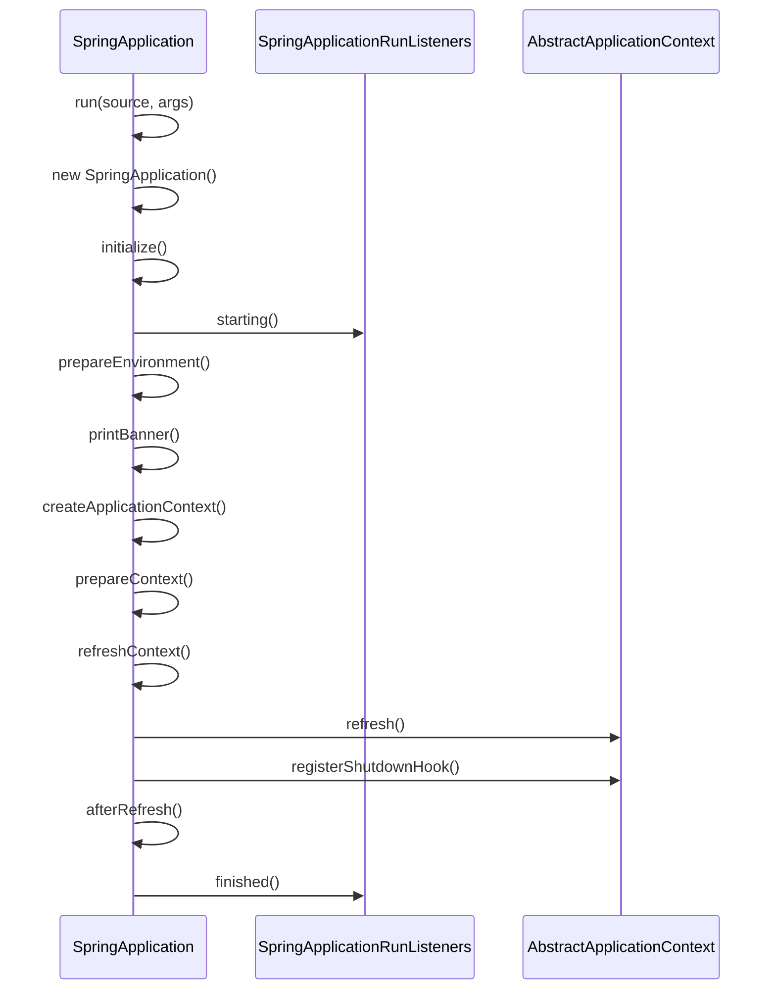

org.springframework.boot.SpringApplication

## define



## fields

### context
```java
	public static final String DEFAULT_CONTEXT_CLASS = "org.springframework.context.annotation.AnnotationConfigApplicationContext";
	public static final String DEFAULT_WEB_CONTEXT_CLASS = "org.springframework.boot.web.servlet.context.AnnotationConfigServletWebServerApplicationContext";
	private static final String[] WEB_ENVIRONMENT_CLASSES = { "javax.servlet.Servlet", "org.springframework.web.context.ConfigurableWebApplicationContext" };

	public static final String DEFAULT_REACTIVE_WEB_CONTEXT_CLASS = "org.springframework.boot.web.reactive.context.AnnotationConfigReactiveWebServerApplicationContext";
	private static final String REACTIVE_WEB_ENVIRONMENT_CLASS = "org.springframework.web.reactive.DispatcherHandler";
	private static final String MVC_WEB_ENVIRONMENT_CLASS = "org.springframework.web.servlet.DispatcherServlet";
```

### properties
```java
	private Class<?> mainApplicationClass;
	private Banner.Mode bannerMode = Banner.Mode.CONSOLE;
	private boolean logStartupInfo = true;
	private boolean addCommandLineProperties = true;
	private Banner banner;
	private ResourceLoader resourceLoader;
	private BeanNameGenerator beanNameGenerator;
	private ConfigurableEnvironment environment;
	private Class<? extends ConfigurableApplicationContext> applicationContextClass;
	private WebApplicationType webApplicationType;
	private boolean headless = true;
	private boolean registerShutdownHook = true;
	private List<ApplicationContextInitializer<?>> initializers;
	private List<ApplicationListener<?>> listeners;
	private Map<String, Object> defaultProperties;
	private Set<String> additionalProfiles = new HashSet<>();
```

## methods

事件回调机制
* 配置在META-INF/spring.factories
  * [ApplicationContextInitializer](/20-framework/src/spring/spring-context/context/ApplicationContextInitializer.md)
  * [SpringApplicationRunListener](SpringApplicationRunListener.md)
* 只需要放在ico容器中
  * [ApplicationRunner](ApplicationRunner.md) 
  * [CommandLineRunner](CommandLineRunner.md)

启动流程
* new SpringApplication(sources)
  * initialize
  * 保存主配置类
  * 推算当前是否一个web应用
  * 从类路径下找到`META-INF/spring.factories`配置的所有`ApplicationContextInitializer`；然后保存
  * 从类路径下找到`META-INF/spring.factories`配置的所有`ApplicationListener`
  * 从多个配置类中找到所有main方法的主配置类
* run(args)
  * 获取`SpringApplicationRunnerListeners`；从类路径下`META-INF/spring.factories`
  * listeners.starting 回调所有的获取`SpringApplicationRunnerListeners.starting()`方法
  * 环境
    * 获取命令行参数，准备环境
    * 创建环境完成后回调`SpringApplicationRunnerListeners.environmentPrepared()`表示环境准备完成
  * 上下文 准备、加载
    * createApplicationContext 决定web的ioc还是普通的ioc
    * prepareContext 准备上下文
      * 将environment保存到ioc中；`applyInitializers`回调之前保存的所有的`ApplicationContextInitializer`
      * 回调`ApplicationListener`
      * 回调`SpringApplicationRunnerListeners.contextLoaded()`
    * refreshContext 刷新上下文，ioc容器初始化过程（如果是web应用还会创建嵌入式的Tomcat）
    * afterRefresh 从ioc容器中获取所有的`ApplicationRunner`和`CommandLineRunner`进行回调
  * listeners.finished 回调所有的获取`SpringApplicationRunnerListeners.finished()`方法



### static run
```java
	public static ConfigurableApplicationContext run(Object source, String... args) {
		return run(new Object[] { source }, args);
	}
	public static ConfigurableApplicationContext run(Class<?>[] primarySources,
			String[] args) {
		return new SpringApplication(primarySources).run(args);
	}	
```
### SpringApplication
```java
	public SpringApplication(Class<?>... primarySources) {
		this(null, primarySources);
	}
	public SpringApplication(ResourceLoader resourceLoader, Class<?>... primarySources) {
		this.resourceLoader = resourceLoader;
		Assert.notNull(primarySources, "PrimarySources must not be null");
		this.primarySources = new LinkedHashSet<>(Arrays.asList(primarySources));
		this.webApplicationType = deduceWebApplicationType();
		setInitializers((Collection) getSpringFactoriesInstances(ApplicationContextInitializer.class));
		setListeners((Collection) getSpringFactoriesInstances(ApplicationListener.class));
		this.mainApplicationClass = deduceMainApplicationClass();
	}	
	
```

### run
```java
	public ConfigurableApplicationContext run(String... args) {
		StopWatch stopWatch = new StopWatch();
		stopWatch.start();
		ConfigurableApplicationContext context = null;
		Collection<SpringBootExceptionReporter> exceptionReporters = new ArrayList<>();
		configureHeadlessProperty();
		SpringApplicationRunListeners listeners = getRunListeners(args);
		listeners.starting();
		try {
			ApplicationArguments applicationArguments = new DefaultApplicationArguments(
					args);
			ConfigurableEnvironment environment = prepareEnvironment(listeners,
					applicationArguments);
			configureIgnoreBeanInfo(environment);
			Banner printedBanner = printBanner(environment);
			context = createApplicationContext();
			exceptionReporters = getSpringFactoriesInstances(
					SpringBootExceptionReporter.class,
					new Class[] { ConfigurableApplicationContext.class }, context);
			prepareContext(context, environment, listeners, applicationArguments,
					printedBanner);
			refreshContext(context);
			afterRefresh(context, applicationArguments);
			stopWatch.stop();
			if (this.logStartupInfo) {
				new StartupInfoLogger(this.mainApplicationClass)
						.logStarted(getApplicationLog(), stopWatch);
			}
			listeners.started(context);
			callRunners(context, applicationArguments);
		}
		catch (Throwable ex) {
			handleRunFailure(context, ex, exceptionReporters, listeners);
			throw new IllegalStateException(ex);
		}

		try {
			listeners.running(context);
		}
		catch (Throwable ex) {
			handleRunFailure(context, ex, exceptionReporters, null);
			throw new IllegalStateException(ex);
		}
		return context;
	}
```

### prepareEnvironment
```java
	private ConfigurableEnvironment prepareEnvironment(
			SpringApplicationRunListeners listeners,
			ApplicationArguments applicationArguments) {
		// Create and configure the environment
		ConfigurableEnvironment environment = getOrCreateEnvironment();
		configureEnvironment(environment, applicationArguments.getSourceArgs());
		listeners.environmentPrepared(environment);
		bindToSpringApplication(environment);
		if (this.webApplicationType == WebApplicationType.NONE) {
			environment = new EnvironmentConverter(getClassLoader())
					.convertToStandardEnvironmentIfNecessary(environment);
		}
		ConfigurationPropertySources.attach(environment);
		return environment;
	}
```

### createApplicationContext
```java
	protected ConfigurableApplicationContext createApplicationContext() {
		Class<?> contextClass = this.applicationContextClass;
		if (contextClass == null) {
			try {
				switch (this.webApplicationType) {
				case SERVLET:
					contextClass = Class.forName(DEFAULT_WEB_CONTEXT_CLASS); // AnnotationConfigServletWebServerApplicationContext
					break;
				case REACTIVE:
					contextClass = Class.forName(DEFAULT_REACTIVE_WEB_CONTEXT_CLASS); // AnnotationConfigReactiveWebServerApplicationContext
					break;
				default:
					contextClass = Class.forName(DEFAULT_CONTEXT_CLASS); // AnnotationConfigApplicationContext
				}
			}
			catch (ClassNotFoundException ex) {
				throw new IllegalStateException(
						"Unable create a default ApplicationContext, "
								+ "please specify an ApplicationContextClass",
						ex);
			}
		}
		return (ConfigurableApplicationContext) BeanUtils.instantiateClass(contextClass);
	}
```

### prepareContext
```java
	private void prepareContext(ConfigurableApplicationContext context,
			ConfigurableEnvironment environment, SpringApplicationRunListeners listeners,
			ApplicationArguments applicationArguments, Banner printedBanner) {
		context.setEnvironment(environment);
		postProcessApplicationContext(context);
		applyInitializers(context);
		listeners.contextPrepared(context);
		if (this.logStartupInfo) {
			logStartupInfo(context.getParent() == null);
			logStartupProfileInfo(context);
		}

		// Add boot specific singleton beans
		context.getBeanFactory().registerSingleton("springApplicationArguments",
				applicationArguments);
		if (printedBanner != null) {
			context.getBeanFactory().registerSingleton("springBootBanner", printedBanner);
		}

		// Load the sources
		Set<Object> sources = getAllSources();
		Assert.notEmpty(sources, "Sources must not be empty");
		load(context, sources.toArray(new Object[0]));
		listeners.contextLoaded(context);
	}
```

### refreshContext
```java
	private void refreshContext(ConfigurableApplicationContext context) {
		refresh(context);
		if (this.registerShutdownHook) {
			try {
				context.registerShutdownHook();
			}
			catch (AccessControlException ex) {
				// Not allowed in some environments.
			}
		}
	}
	protected void refresh(ApplicationContext applicationContext) {
		Assert.isInstanceOf(AbstractApplicationContext.class, applicationContext);
		((AbstractApplicationContext) applicationContext).refresh();
	}	
```

### afterRefresh
```java
	protected void afterRefresh(ConfigurableApplicationContext context,
			ApplicationArguments args) {
	}	
```

### callRunners
```java
	private void callRunners(ApplicationContext context, ApplicationArguments args) {
		List<Object> runners = new ArrayList<>();
		runners.addAll(context.getBeansOfType(ApplicationRunner.class).values());
		runners.addAll(context.getBeansOfType(CommandLineRunner.class).values());
		AnnotationAwareOrderComparator.sort(runners);
		for (Object runner : new LinkedHashSet<>(runners)) {
			if (runner instanceof ApplicationRunner) {
				callRunner((ApplicationRunner) runner, args);
			}
			if (runner instanceof CommandLineRunner) {
				callRunner((CommandLineRunner) runner, args);
			}
		}
	}
```

## context
* [AnnotationConfigEmbeddedWebApplicationContext](/docs/20-framework/src/spring/spring-boot/spring-boot/context/embedded/AnnotationConfigEmbeddedWebApplicationContext.md)
* [AnnotationConfigServletWebServerApplicationContext](/docs/20-framework/src/spring/spring-boot/spring-boot/web/servlet/AnnotationConfigServletWebServerApplicationContext.md)
