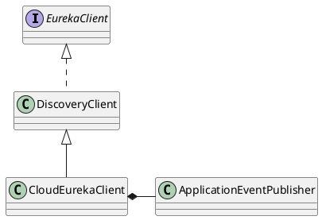

com.netflix.discovery.DiscoveryClient

## hierarchy


## define

```java
@Singleton
public class DiscoveryClient implements EurekaClient {
    /**
     * A scheduler to be used for the following 3 tasks:
     * - updating service urls
     * - scheduling a TimedSuperVisorTask
     */
    private final ScheduledExecutorService scheduler;
    // additional executors for supervised subtasks
    private final ThreadPoolExecutor heartbeatExecutor;
    private final ThreadPoolExecutor cacheRefreshExecutor;

    private TimedSupervisorTask cacheRefreshTask;
    private TimedSupervisorTask heartbeatTask;
}

```

## methods