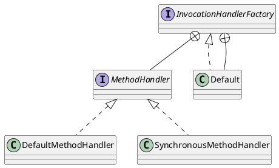

feign.SynchronousMethodHandler

## Hierarchy
```

```

## Define


## Methods

### invoke
- 请求模板
- 选项
- 重试机制
- 编码-执行-解码

```java
  @Override
  public Object invoke(Object[] argv) throws Throwable {
    RequestTemplate template = buildTemplateFromArgs.create(argv);
    Options options = findOptions(argv);
    Retryer retryer = this.retryer.clone();
    while (true) {
      try {
        return executeAndDecode(template, options);
      } catch (RetryableException e) {
        try {
          retryer.continueOrPropagate(e);
        } catch (RetryableException th) {
          Throwable cause = th.getCause();
          if (propagationPolicy == UNWRAP && cause != null) {
            throw cause;
          } else {
            throw th;
          }
        }
        if (logLevel != Logger.Level.NONE) {
          logger.logRetry(metadata.configKey(), logLevel);
        }
        continue;
      }
    }
  }
```

### executeAndDecode
- 请求模板转为请求，调用拦截器
- client发起请求
- decode解码

```java
  Object executeAndDecode(RequestTemplate template, Options options) throws Throwable {
    Request request = targetRequest(template);

    if (logLevel != Logger.Level.NONE) {
      logger.logRequest(metadata.configKey(), logLevel, request);
    }

    Response response;
    long start = System.nanoTime();
    try {
      response = client.execute(request, options);
      // ensure the request is set. TODO: remove in Feign 12
      response = response.toBuilder()
          .request(request)
          .requestTemplate(template)
          .build();
    } catch (IOException e) {
      if (logLevel != Logger.Level.NONE) {
        logger.logIOException(metadata.configKey(), logLevel, e, elapsedTime(start));
      }
      throw errorExecuting(request, e);
    }
    long elapsedTime = TimeUnit.NANOSECONDS.toMillis(System.nanoTime() - start);


    if (decoder != null)
      return decoder.decode(response, metadata.returnType());

    CompletableFuture<Object> resultFuture = new CompletableFuture<>();
    asyncResponseHandler.handleResponse(resultFuture, metadata.configKey(), response,
        metadata.returnType(),
        elapsedTime);

    try {
      if (!resultFuture.isDone())
        throw new IllegalStateException("Response handling not done");

      return resultFuture.join();
    } catch (CompletionException e) {
      Throwable cause = e.getCause();
      if (cause != null)
        throw cause;
      throw e;
    }
  }
```

### targetRequest
目标请求，调用拦截器

```java
  Request targetRequest(RequestTemplate template) {
    for (RequestInterceptor interceptor : requestInterceptors) {
      interceptor.apply(template);
    }
    return target.apply(template);
  }
```