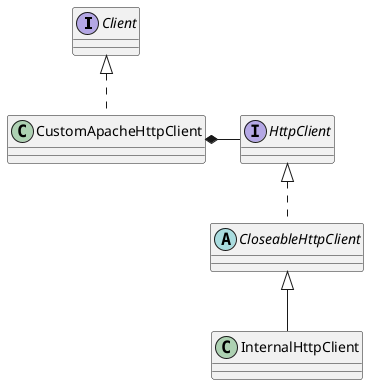

feign.httpclient.ApacheHttpClient

## Hierarchy
```
Client (feign)
    Default in Client (feign)
    LazyClient (org.springframework.cloud.sleuth.instrument.web.client.feign)
    TracingFeignClient (org.springframework.cloud.sleuth.instrument.web.client.feign)
    ApacheHttpClient (feign.httpclient)
    LazyTracingFeignClient (org.springframework.cloud.sleuth.instrument.web.client.feign)
    FeignBlockingLoadBalancerClient (org.springframework.cloud.openfeign.loadbalancer)
    LoadBalancerFeignClient (org.springframework.cloud.openfeign.ribbon)
```

## Define




## Methods

### execute
FeignRequest -> httpReqeust -> httpClient -> httpResponse -> FeignResponse

```java
    @Override
    public Response execute(Request request, Request.Options options) throws IOException {
        HttpUriRequest httpUriRequest;
        try {
            httpUriRequest = toHttpUriRequest(request, options);
        } catch (URISyntaxException e) {
            throw new IOException("URL '" + request.url() + "' couldn't be parsed into a URI", e);
        }
        HttpResponse httpResponse = client.execute(httpUriRequest);
        return toFeignResponse(httpResponse, request);
    }
```