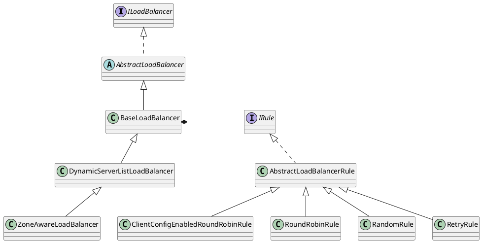

com.netflix.loadbalancer.ILoadBalancer
## hierarchy
```
ILoadBalancer (com.netflix.loadbalancer)
    AbstractLoadBalancer (com.netflix.loadbalancer)
        NoOpLoadBalancer (com.netflix.loadbalancer)
        BaseLoadBalancer (com.netflix.loadbalancer)
            DynamicServerListLoadBalancer (com.netflix.loadbalancer)
                ZoneAwareLoadBalancer (com.netflix.loadbalancer)
```

