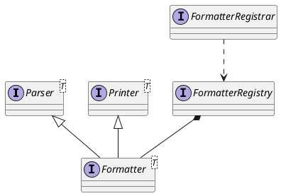

org.springframework.format

## package
```
annotation
    DateTimeFormat      日期格式化注解
    NumberFormat
datetime
    joda                 面向 Java 应用程序的日期/时间库的替代选择
    standard
    DateFormatter
    DateFormatterRegistrar
    DateTimeFormatAnnotationFormatterFactory
number
support

AnnotationFormatterFactory
Formatter
FormatterRegistrar
FormatterRegistry
Parser
Printer
```

