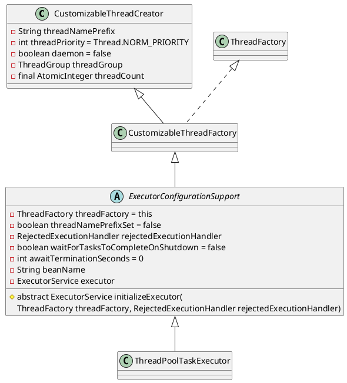

org.springframework.scheduling.concurrent.ThreadPoolTaskExecutor

## hierarchy
```
CustomizableThreadCreator (org.springframework.util)
    CustomizableThreadFactory (org.springframework.scheduling.concurrent)
        ExecutorConfigurationSupport (org.springframework.scheduling.concurrent)
            ThreadPoolTaskExecutor (org.springframework.scheduling.concurrent)
```

## define

