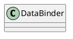

org.springframework.validation.DataBinder

## hierarchy
```
DataBinder (org.springframework.validation)
    RelaxedDataBinder (org.springframework.boot.bind)
    WebDataBinder (org.springframework.web.bind)
        ServletRequestDataBinder (org.springframework.web.bind)
        WebRequestDataBinder (org.springframework.web.bind.support)
```

## define


```java
public class DataBinder implements PropertyEditorRegistry, TypeConverter {
    
}
```

## fields


## methods