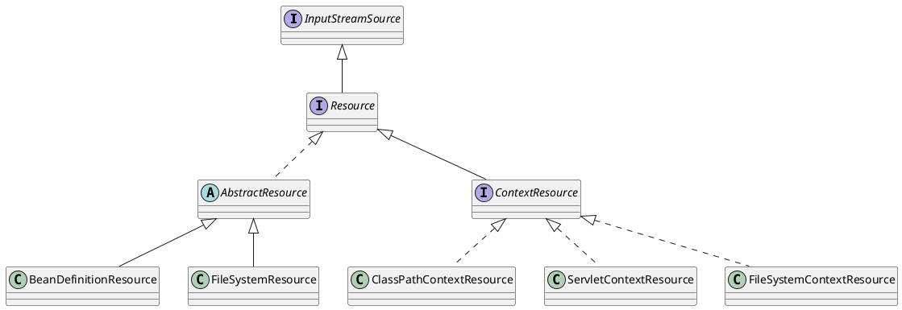

org.springframework.core.io.Resource

## Hierarchy
```
Resource (org.springframework.core.io)
    ContextResource (org.springframework.core.io)
        ClassRelativeContextResource in ClassRelativeResourceLoader (org.springframework.core.io)
        ClassPathContextResource in DefaultResourceLoader (org.springframework.core.io)
        ServletContextResource (org.springframework.web.context.support)
        FileSystemContextResource in FileSystemResourceLoader (org.springframework.core.io)
    WritableResource (org.springframework.core.io)
        FileUrlResource (org.springframework.core.io)
        FileSystemResource (org.springframework.core.io)
            FileSystemContextResource in FileSystemResourceLoader (org.springframework.core.io)
        PathResource (org.springframework.core.io)
    HttpResource (org.springframework.web.servlet.resource)
        GzippedResource in GzipResourceResolver (org.springframework.web.servlet.resource)
        FileNameVersionedResource in VersionResourceResolver (org.springframework.web.servlet.resource)
    AbstractResource (org.springframework.core.io)
        DescriptiveResource (org.springframework.core.io)
        BeanDefinitionResource (org.springframework.beans.factory.support)
        AbstractFileResolvingResource (org.springframework.core.io)
            UrlResource (org.springframework.core.io)
                FileUrlResource (org.springframework.core.io)
            ClassPathResource (org.springframework.core.io)
                ClassRelativeContextResource in ClassRelativeResourceLoader (org.springframework.core.io)
                ClassPathContextResource in DefaultResourceLoader (org.springframework.core.io)
            ServletContextResource (org.springframework.web.context.support)
        GzippedResource in GzipResourceResolver (org.springframework.web.servlet.resource)
        FileNameVersionedResource in VersionResourceResolver (org.springframework.web.servlet.resource)
        InputStreamResource (org.springframework.core.io)
            1 in ResourceHttpMessageConverter (org.springframework.http.converter)
        FilteredReactiveWebContextResource (org.springframework.boot.web.reactive.context)
        FileSystemResource (org.springframework.core.io)
            FileSystemContextResource in FileSystemResourceLoader (org.springframework.core.io)
        InMemoryResource (org.springframework.security.util)
        VfsResource (org.springframework.core.io)
        ByteArrayResource (org.springframework.core.io)
            2 in ResourceHttpMessageConverter (org.springframework.http.converter)
            TransformedResource (org.springframework.web.servlet.resource)
        PathResource (org.springframework.core.io)
```

## Define
