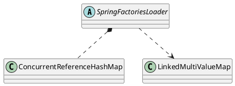

org.springframework.core.io.support.SpringFactoriesLoader

* META-INF/spring.factories
* LinkedMultiValueMap
* ConcurrentReferenceHashMap

## define


```java
public abstract class SpringFactoriesLoader {
	public static final String FACTORIES_RESOURCE_LOCATION = "META-INF/spring.factories";
	private static final Map<ClassLoader, MultiValueMap<String, String>> cache = new ConcurrentReferenceHashMap<>();
}	
```