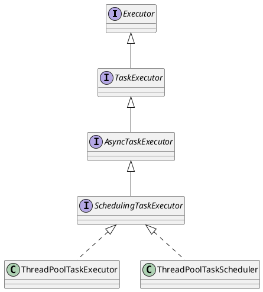

org.springframework.core.task.TaskExecutor

## hierarchy
```
TaskExecutor (org.springframework.core.task)
    SyncTaskExecutor (org.springframework.core.task)
    AsyncTaskExecutor (org.springframework.core.task)
        SchedulingTaskExecutor (org.springframework.scheduling)
            ThreadPoolTaskExecutor (org.springframework.scheduling.concurrent)
            SimpleThreadPoolTaskExecutor (org.springframework.scheduling.quartz)
            WorkManagerTaskExecutor (org.springframework.scheduling.commonj)
            ConcurrentTaskExecutor (org.springframework.scheduling.concurrent)
                DefaultManagedTaskExecutor (org.springframework.scheduling.concurrent)
                ConcurrentTaskScheduler (org.springframework.scheduling.concurrent)
                    DefaultManagedTaskScheduler (org.springframework.scheduling.concurrent)
            DelegatingSecurityContextSchedulingTaskExecutor (org.springframework.security.scheduling)
            ThreadPoolTaskScheduler (org.springframework.scheduling.concurrent)
            WorkManagerTaskExecutor (org.springframework.jca.work)
        DelegatingSecurityContextAsyncTaskExecutor (org.springframework.security.task)
            DelegatingSecurityContextSchedulingTaskExecutor (org.springframework.security.scheduling)
        AsyncListenableTaskExecutor (org.springframework.core.task)
            ThreadPoolTaskExecutor (org.springframework.scheduling.concurrent)
            SimpleThreadPoolTaskExecutor (org.springframework.scheduling.quartz)
            TaskExecutorAdapter (org.springframework.core.task.support)
                ManagedTaskExecutorAdapter in ConcurrentTaskExecutor (org.springframework.scheduling.concurrent)
            SimpleAsyncTaskExecutor (org.springframework.core.task)
            WorkManagerTaskExecutor (org.springframework.scheduling.commonj)
            ConcurrentTaskExecutor (org.springframework.scheduling.concurrent)
                DefaultManagedTaskExecutor (org.springframework.scheduling.concurrent)
                ConcurrentTaskScheduler (org.springframework.scheduling.concurrent)
                    DefaultManagedTaskScheduler (org.springframework.scheduling.concurrent)
            ThreadPoolTaskScheduler (org.springframework.scheduling.concurrent)
            WorkManagerTaskExecutor (org.springframework.jca.work)
    DelegatingSecurityContextTaskExecutor (org.springframework.security.task)
        DelegatingSecurityContextAsyncTaskExecutor (org.springframework.security.task)
            DelegatingSecurityContextSchedulingTaskExecutor (org.springframework.security.scheduling)
```

## define

