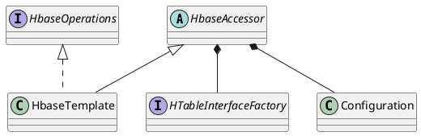

org.springframework.data.hadoop.hbase.HbaseTemplate

## Hierarchy
```
HbaseAccessor (org.springframework.data.hadoop.hbase)
    HbaseTemplate (org.springframework.data.hadoop.hbase)
        WrappedHbaseTemplate (cn.com.duibaboot.ext.autoconfigure.data.hbase)
```
## Define

```java
public class HbaseTemplate extends HbaseAccessor implements HbaseOperations {
	private boolean autoFlush = true;
	public HbaseTemplate(Configuration configuration) {
		setConfiguration(configuration);
		afterPropertiesSet();
	}
}
```
