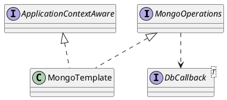

org.springframework.data.mongodb.core.MongoTemplate

## Hierarchy
```
MongoTemplate (org.springframework.data.mongodb.core)
    MongoOperations (org.springframework.data.mongodb.core)
    ApplicationContextAware (org.springframework.context)
        Aware (org.springframework.beans.factory)
```
## Define
