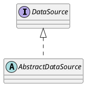

org.springframework.jdbc.datasource.AbstractDataSource

## Hierarchy
```
AbstractDataSource (org.springframework.jdbc.datasource)
    AbstractDriverBasedDataSource (org.springframework.jdbc.datasource)
        SimpleDriverDataSource (org.springframework.jdbc.datasource)
        DriverManagerDataSource (org.springframework.jdbc.datasource)
            SingleConnectionDataSource (org.springframework.jdbc.datasource)
    AbstractRoutingDataSource (org.springframework.jdbc.datasource.lookup)
        IsolationLevelDataSourceRouter (org.springframework.jdbc.datasource.lookup)
```

## Define
