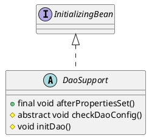

org.springframework.dao.support.DaoSupport

## hierarchy
```
DaoSupport (org.springframework.dao.support)
    CciDaoSupport (org.springframework.jca.cci.core.support)
    HibernateDaoSupport (org.springframework.orm.hibernate5.support)
    JdbcDaoSupport (org.springframework.jdbc.core.support)
        JdbcDaoImpl (org.springframework.security.core.userdetails.jdbc)
    SqlSessionDaoSupport (org.mybatis.spring.support)
        MapperFactoryBean (org.mybatis.spring.mapper)
```

## define

