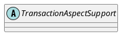

org.springframework.transaction.interceptor.TransactionAspectSupport

## define


## methods

### invokeWithinTransaction
```java
protected Object invokeWithinTransaction(Method method, Class<?> targetClass, final InvocationCallback invocation)
			throws Throwable {

		// If the transaction attribute is null, the method is non-transactional.
		final TransactionAttribute txAttr = getTransactionAttributeSource().getTransactionAttribute(method, targetClass);
		final PlatformTransactionManager tm = determineTransactionManager(txAttr);
		final String joinpointIdentification = methodIdentification(method, targetClass, txAttr);

		if (txAttr == null || !(tm instanceof CallbackPreferringPlatformTransactionManager)) {
			// Standard transaction demarcation with getTransaction and commit/rollback calls.
			TransactionInfo txInfo = createTransactionIfNecessary(tm, txAttr, joinpointIdentification);

			Object retVal;
			try {
				// This is an around advice: Invoke the next interceptor in the chain.
				// This will normally result in a target object being invoked.
				retVal = invocation.proceedWithInvocation();
			}
			catch (Throwable ex) {
				// target invocation exception
				completeTransactionAfterThrowing(txInfo, ex);
				throw ex;
			}
			finally {
				cleanupTransactionInfo(txInfo);
			}
			commitTransactionAfterReturning(txInfo);
			return retVal;
		}

		else {
			final ThrowableHolder throwableHolder = new ThrowableHolder();

			// It's a CallbackPreferringPlatformTransactionManager: pass a TransactionCallback in.
			try {
				Object result = ((CallbackPreferringPlatformTransactionManager) tm).execute(txAttr,
						new TransactionCallback<Object>() {
							@Override
							public Object doInTransaction(TransactionStatus status) {
								TransactionInfo txInfo = prepareTransactionInfo(tm, txAttr, joinpointIdentification, status);
								try {
									return invocation.proceedWithInvocation();
								}
								catch (Throwable ex) {
									if (txAttr.rollbackOn(ex)) {
										// A RuntimeException: will lead to a rollback.
										if (ex instanceof RuntimeException) {
											throw (RuntimeException) ex;
										}
										else {
											throw new ThrowableHolderException(ex);
										}
									}
									else {
										// A normal return value: will lead to a commit.
										throwableHolder.throwable = ex;
										return null;
									}
								}
								finally {
									cleanupTransactionInfo(txInfo);
								}
							}
						});

				// Check result state: It might indicate a Throwable to rethrow.
				if (throwableHolder.throwable != null) {
					throw throwableHolder.throwable;
				}
				return result;
			}
			catch (ThrowableHolderException ex) {
				throw ex.getCause();
			}
			catch (TransactionSystemException ex2) {
				if (throwableHolder.throwable != null) {
					logger.error("Application exception overridden by commit exception", throwableHolder.throwable);
					ex2.initApplicationException(throwableHolder.throwable);
				}
				throw ex2;
			}
			catch (Throwable ex2) {
				if (throwableHolder.throwable != null) {
					logger.error("Application exception overridden by commit exception", throwableHolder.throwable);
				}
				throw ex2;
			}
		}
	}

```