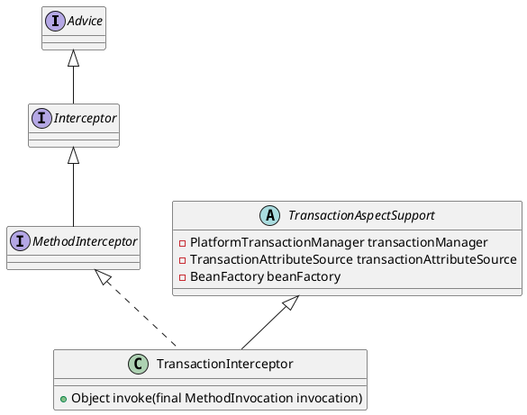

org.springframework.transaction.interceptor.TransactionInterceptor

## hierarchy
```
TransactionAspectSupport (org.springframework.transaction.interceptor)
    TransactionInterceptor (org.springframework.transaction.interceptor)

// extends 
TransactionInterceptor (org.springframework.transaction.interceptor)
    MethodInterceptor (org.aopalliance.intercept)
        Interceptor (org.aopalliance.intercept)
            Advice (org.aopalliance.aop)
    Serializable (java.io)
    TransactionAspectSupport (org.springframework.transaction.interceptor)
        BeanFactoryAware (org.springframework.beans.factory)
            Aware (org.springframework.beans.factory)
        InitializingBean (org.springframework.beans.factory)
        Object (java.lang)
```

## define

