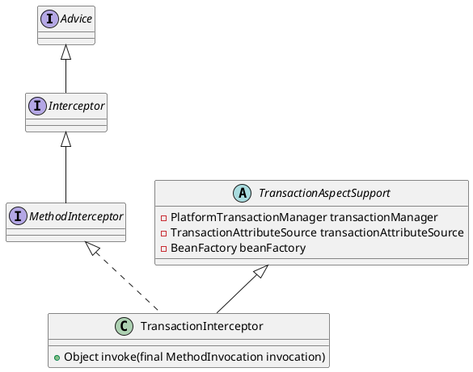

org.springframework.transaction.interceptor.TransactionInterceptor

## hierarchy
```
TransactionAspectSupport (org.springframework.transaction.interceptor)
    TransactionInterceptor (org.springframework.transaction.interceptor)

// extends 
TransactionInterceptor (org.springframework.transaction.interceptor)
    MethodInterceptor (org.aopalliance.intercept)
        Interceptor (org.aopalliance.intercept)
            Advice (org.aopalliance.aop)
    Serializable (java.io)
    TransactionAspectSupport (org.springframework.transaction.interceptor)
        BeanFactoryAware (org.springframework.beans.factory)
            Aware (org.springframework.beans.factory)
        InitializingBean (org.springframework.beans.factory)
        Object (java.lang)
```

## define



## methods

### invoke
```java
	@Override
	public Object invoke(final MethodInvocation invocation) throws Throwable {
		// Work out the target class: may be {@code null}.
		// The TransactionAttributeSource should be passed the target class
		// as well as the method, which may be from an interface.
		Class<?> targetClass = (invocation.getThis() != null ? AopUtils.getTargetClass(invocation.getThis()) : null);

		// Adapt to TransactionAspectSupport's invokeWithinTransaction...
		return invokeWithinTransaction(invocation.getMethod(), targetClass, new InvocationCallback() {
			@Override
			public Object proceedWithInvocation() throws Throwable {
				return invocation.proceed();
			}
		});
	}
```