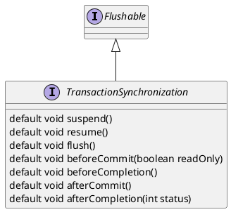

org.springframework.transaction.support.TransactionSynchronization

## define

```plantuml
@startuml
interface Flushable
Flushable ^-- TransactionSynchronization

interface TransactionSynchronization {
    default void suspend()
    default void resume() 
    default void flush()
    default void beforeCommit(boolean readOnly)
    default void beforeCompletion()
    default void afterCommit()
    default void afterCompletion(int status)
}

@enduml
```