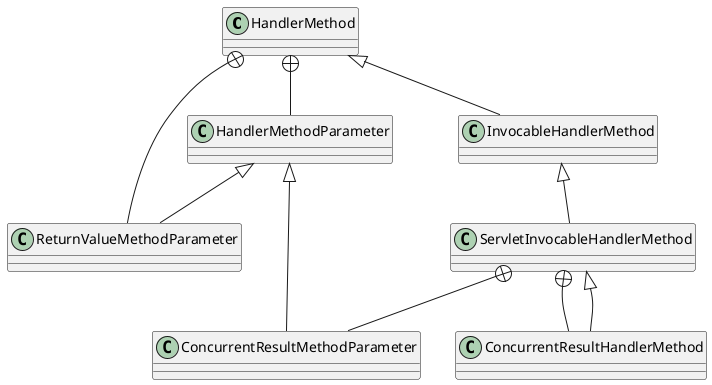

org.springframework.web.method.support.InvocableHandlerMethod

## hierarchy
```
HandlerMethod (org.springframework.web.method)
    InvocableHandlerMethod (org.springframework.web.method.support)
        ServletInvocableHandlerMethod (org.springframework.web.servlet.mvc.method.annotation)
            ConcurrentResultHandlerMethod in ServletInvocableHandlerMethod (org.springframework.web.servlet.mvc.method.annotation)
```
## define



## 桥接方法

桥接方法是 JDK 1.5 引入泛型后，为了使Java的泛型方法生成的字节码和 1.5 版本前的字节码相兼容，由编译器自动生成的方法。
可以通过Method.isBridge()方法来判断一个方法是否是桥接方法。
在字节码中桥接方法会被标记为ACC_BRIDGE和ACC_SYNTHETIC，其中ACC_BRIDGE用于说明这个方法是由编译生成的桥接方法，ACC_SYNTHETIC说明这个方法是由编译器生成，并且不会在源代码中出现。

一个子类在继承（或实现）一个父类（或接口）的泛型方法时，在子类中明确指定了泛型类型，那么在编译时编译器会自动生成桥接方法

org.springframework.core.BridgeMethodResolver

[java中什么是bridge method（桥接方法）](https://blog.csdn.net/mhmyqn/article/details/47342577 )

```java
public interface SuperClass<T> {
    T method(T param);
}
 
public class SubClass implements SuperClass<String> {
    public String method(String param) {
        return param;
    }
    // 编译器生成的桥接方法 flags：ACC_BRIDGE和ACC_SYNTHETIC
    public Object method(Object param) {
        return this.method(((String) param)); // 桥接方法实际是是调用了实际的泛型方法
    }
}

```

通过桥接方法获取实际的方法
spring中org.springframework.core.BridgeMethodResolver类的源码。通过判断方法名、参数的个数以及泛型类型参数来获取的


## methods

### invokeForRequest
```java
	public Object invokeForRequest(NativeWebRequest request, ModelAndViewContainer mavContainer,
			Object... providedArgs) throws Exception {
		Object[] args = getMethodArgumentValues(request, mavContainer, providedArgs);
        // log ..
		Object returnValue = doInvoke(args);
        // log ..
		return returnValue;
	}
```

### doInvoke
```java
    protected Object doInvoke(Object... args) throws Exception {
		ReflectionUtils.makeAccessible(getBridgedMethod());
		try {
			return getBridgedMethod().invoke(getBean(), args);
		}
		catch (IllegalArgumentException ex) {
			assertTargetBean(getBridgedMethod(), getBean(), args);
			String text = (ex.getMessage() != null ? ex.getMessage() : "Illegal argument");
			throw new IllegalStateException(getInvocationErrorMessage(text, args), ex);
		}
		catch (InvocationTargetException ex) {
			// Unwrap for HandlerExceptionResolvers ...
			Throwable targetException = ex.getTargetException();
			if (targetException instanceof RuntimeException) {
				throw (RuntimeException) targetException;
			}
			else if (targetException instanceof Error) {
				throw (Error) targetException;
			}
			else if (targetException instanceof Exception) {
				throw (Exception) targetException;
			}
			else {
				String text = getInvocationErrorMessage("Failed to invoke handler method", args);
				throw new IllegalStateException(text, targetException);
			}
		}
	}
```