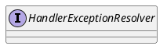

org.springframework.web.servlet.HandlerExceptionResolver

## hierarchy
```
HandlerExceptionResolver (org.springframework.web.servlet)
    HandlerExceptionResolverComposite (org.springframework.web.servlet.handler)
    DefaultErrorAttributes (org.springframework.boot.autoconfigure.web)
    CompositeHandlerExceptionResolver in EndpointWebMvcChildContextConfiguration (org.springframework.boot.actuate.autoconfigure)
    DefaultErrorAttributes (org.springframework.boot.web.servlet.error)
    AbstractHandlerExceptionResolver (org.springframework.web.servlet.handler)
        SimpleMappingExceptionResolver (org.springframework.web.servlet.handler)
        AnnotationMethodHandlerExceptionResolver (org.springframework.web.servlet.mvc.annotation)
        AbstractHandlerMethodExceptionResolver (org.springframework.web.servlet.handler)
            ExceptionHandlerExceptionResolver (org.springframework.web.servlet.mvc.method.annotation)
            DefaultHandlerExceptionResolver (org.springframework.web.servlet.mvc.support)
            ResponseStatusExceptionResolver (org.springframework.web.servlet.mvc.annotation)
```

## define

