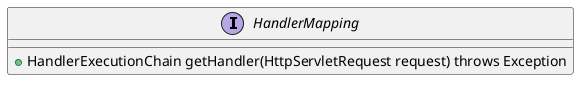
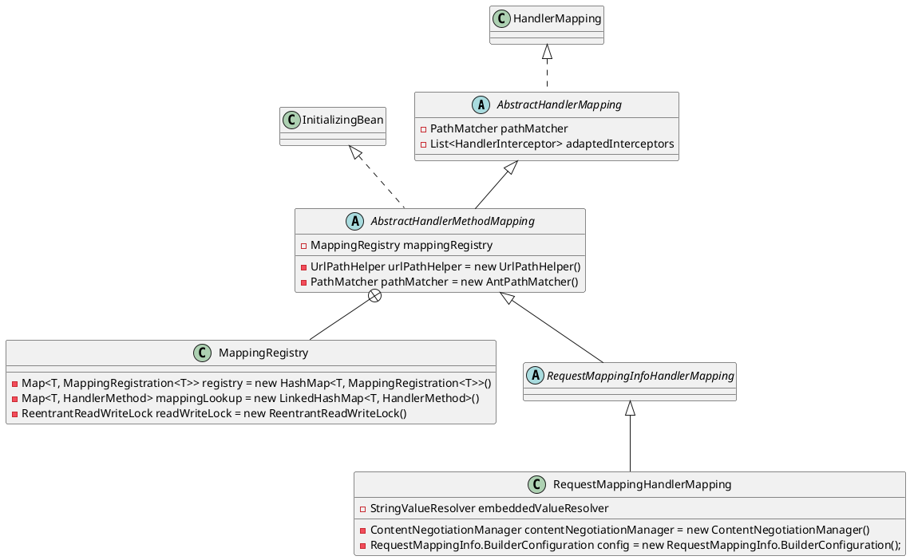
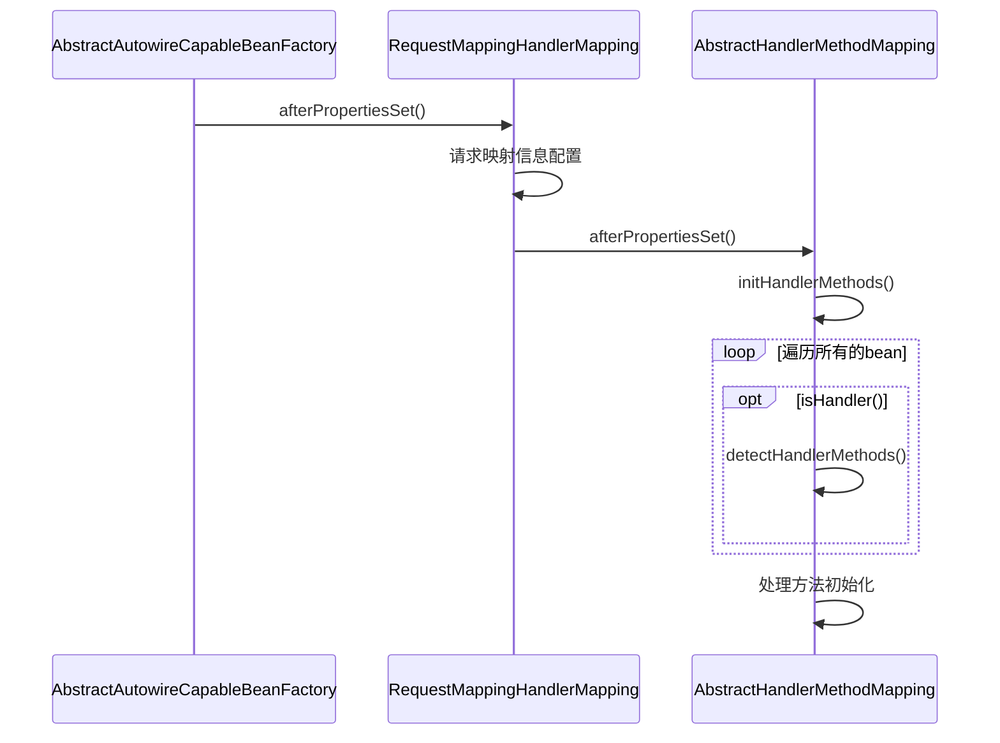
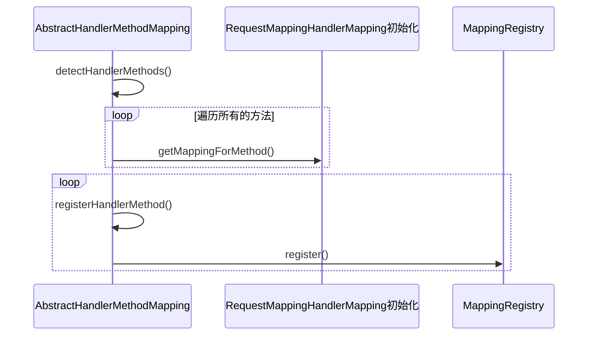
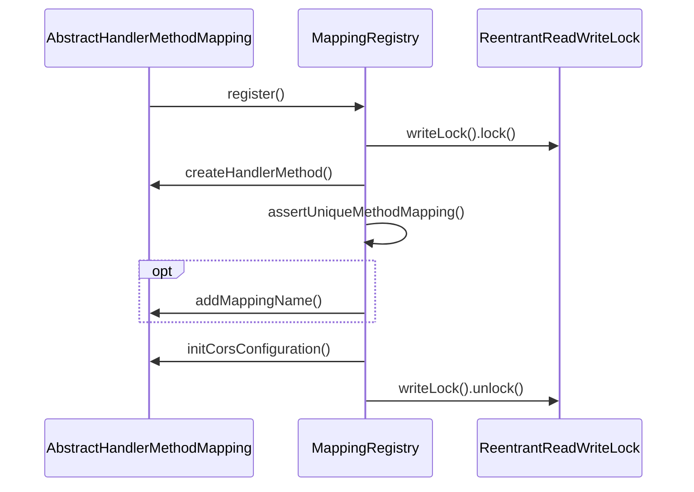
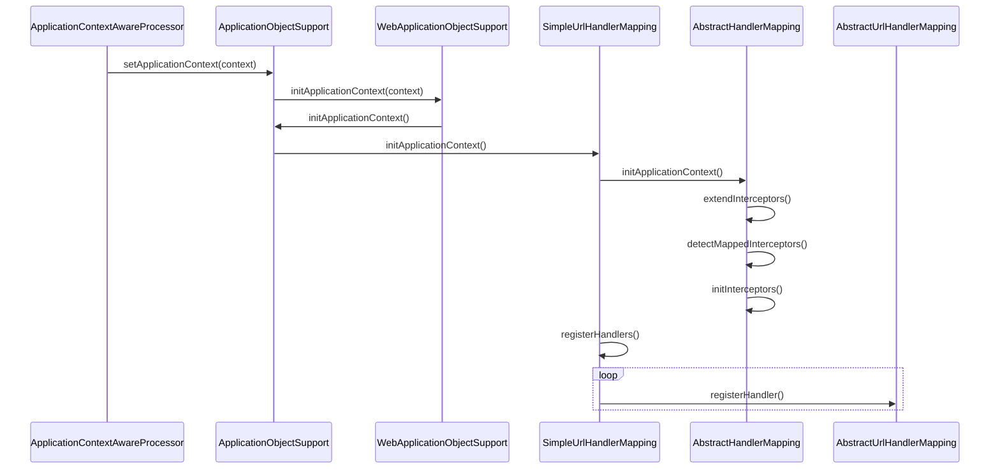

org.springframework.web.servlet.HandlerMapping

## 1. hierachical
```
HandlerMapping (org.springframework.web.servlet)                                                                                    
    MatchableHandlerMapping (org.springframework.web.servlet.handler)
    AbstractHandlerMapping (org.springframework.web.servlet.handler)                                                                
        EmptyHandlerMapping in WebMvcConfigurationSupport (org.springframework.web.servlet.config.annotation)
        AbstractUrlHandlerMapping (org.springframework.web.servlet.handler)
            AbstractDetectingUrlHandlerMapping (org.springframework.web.servlet.handler)
                DefaultAnnotationHandlerMapping (org.springframework.web.servlet.mvc.annotation)
                BeanNameUrlHandlerMapping (org.springframework.web.servlet.handler)
                AbstractControllerUrlHandlerMapping (org.springframework.web.servlet.mvc.support)
                    ControllerClassNameHandlerMapping (org.springframework.web.servlet.mvc.support)
                    ControllerBeanNameHandlerMapping (org.springframework.web.servlet.mvc.support)
            WelcomePageHandlerMapping in WebMvcAutoConfiguration (org.springframework.boot.autoconfigure.web)
            SimpleUrlHandlerMapping (org.springframework.web.servlet.handler)
        AbstractHandlerMethodMapping (org.springframework.web.servlet.handler)                                                      
            RequestMappingInfoHandlerMapping (org.springframework.web.servlet.mvc.method)                                           
                RequestMappingHandlerMapping (org.springframework.web.servlet.mvc.method.annotation)                                
```

## 2. define



```yuml
// {type:class}

// 
[HandlerMapping{bg:tomato}]
[ApplicationObjectSupport{bg:thistle}]
[WebApplicationObjectSupport{bg:thistle}]
[AbstractHandlerMapping{bg:wheat}]
[AbstractHandlerMethodMapping{bg:wheat}]
[RequestMappingInfoHandlerMapping{bg:wheat}]
[RequestMappingHandlerMapping{bg:tomato}]


// 1. HandlerMapping接口
[HandlerMapping]^-[MatchableHandlerMapping]
[MatchableHandlerMapping]^-.-[RequestMappingHandlerMapping]


// 2. RequestMappingHandlerMapping的继承层次
[ApplicationContextAware]^-.-[ApplicationObjectSupport]
[ApplicationObjectSupport]^-[WebApplicationObjectSupport]
[ServletContextAware]^-.-[WebApplicationObjectSupport]

[WebApplicationObjectSupport]^-[AbstractHandlerMapping]
[HandlerMapping]^-.-[AbstractHandlerMapping]
[Ordered]^-.-[AbstractHandlerMapping]

// 抽象处理器方法映射
[AbstractHandlerMapping]^-[AbstractHandlerMethodMapping]
[InitializingBean]^-.-[AbstractHandlerMethodMapping]

// 请求映射信息处理器映射
[AbstractHandlerMethodMapping]^-[RequestMappingInfoHandlerMapping]

// 请求映射处理器映射
[RequestMappingInfoHandlerMapping]^-[RequestMappingHandlerMapping]

[EmbeddedValueResolverAware]^-.-[RequestMappingHandlerMapping]

// 感知接口
[Aware]^-[ApplicationContextAware]
[Aware]^-[ServletContextAware]
[Aware]^-[EmbeddedValueResolverAware]
```

## 3. RequestMappingHandlerMapping


### 3.1 RequestMappingHandlerMapping 初始化
* 上下文 预实例化非懒加载单例bean AbstractApplicationContext.finishBeanFactoryInitialization()
* [InitializingBean.afterPropertiesSet()](/20-framework/src/spring/spring-beans/factory/support/AbstractAutowireCapableBeanFactory.md) 
* 初始化处理器方法
* 查找处理映射方法，创建HandlerMethod，注册MappingRegistry



### 3.2 AbstractHandlerMethodMapping.detectHandlerMethods()


### 3.3 MappingRegistry.register()



## 4. SimpleUrlHandlerMapping

### 4.1 SimpleUrlHandlerMapping 初始化
* 上下文 预实例化非懒加载单例bean AbstractApplicationContext.finishBeanFactoryInitialization()
* [AbstractAutowireCapableBeanFactory.initializeBean()后处理器方法，在InitializingBean.afterPropertiesSet()之前执行](/20-framework/src/spring/spring-beans/factory/support/AbstractAutowireCapableBeanFactory.md) 


