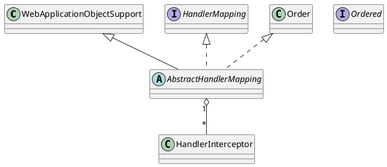

org.springframework.web.servlet.handler.AbstractHandlerMapping

## hierarchy
```
ApplicationObjectSupport (org.springframework.context.support)
    WebApplicationObjectSupport (org.springframework.web.context.support)
        AbstractHandlerMapping (org.springframework.web.servlet.handler)
            AbstractHandlerMethodMapping (org.springframework.web.servlet.handler)  
            AbstractUrlHandlerMapping (org.springframework.web.servlet.handler) 
```

* 处理方法映射 RequestMappingHandlerMapping
* url处理映射
  * 简单url映射
  * bean名称url映射
  * 控制器url映射
    * 控制器bean名称映射
    * 控制器class名称映射

## define
