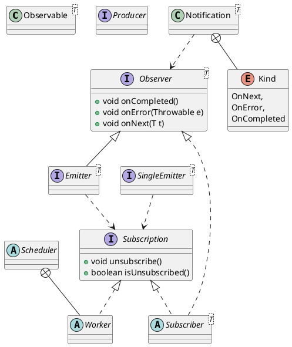

RxJava – Reactive Extensions for the JVM – 
a library for composing asynchronous and event-based programs using observable sequences for the Java VM.

响应式编程是一种基于异步数据流概念的编程模式

RxJava - JVM响应式扩展Reactive Extensions 用于使用Java VM的可观察序列编写异步和基于事件的程序的库。

rx
## pacakge
```
annotations
exceptions
functions
internal
observables
observers
plugins
schedulers
singles
subjects
subscriptions
BackpressureOverflow
Completable
CompletableEmitter
CompletableSubscriber
Emitter
Notification
Observable
Observer
Producer
Scheduler
Single
SingleEmitter
SingleSubscriber
Subscriber
Subscription
```

## overview
