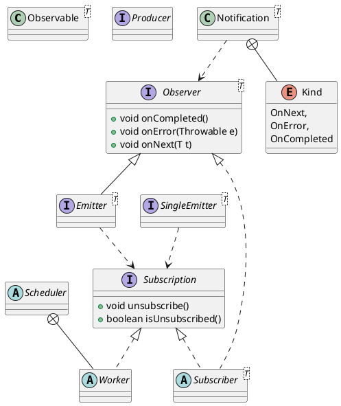

rx
## pacakge
```
annotations
exceptions
functions
internal
observables
observers
plugins
schedulers
singles
subjects
subscriptions
BackpressureOverflow
Completable
CompletableEmitter
CompletableSubscriber
Emitter
Notification
Observable
Observer
Producer
Scheduler
Single
SingleEmitter
SingleSubscriber
Subscriber
Subscription
```

## overview
- 被观察者  Observable
- 观察者 Observer
- 订阅 Subscribe
- 事件 Event

