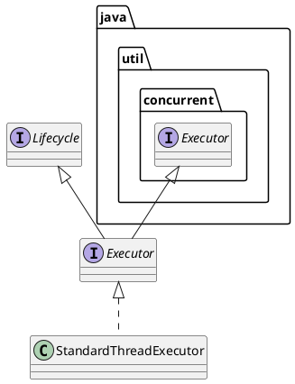

org.apache.catalina.Executor
## hierarchy
```
Executor (org.apache.catalina)
    StandardThreadExecutor (org.apache.catalina.core)
Executor (org.apache.catalina)
    Executor (java.util.concurrent)
    Lifecycle (org.apache.catalina)
```

## define


## fields


## methods