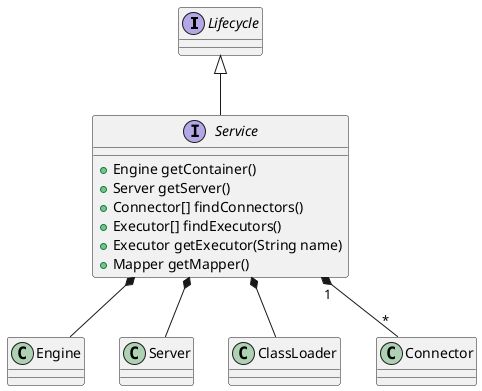

org.apache.catalina.Service

## hierarchy
```
Service (org.apache.catalina)
    StandardService (org.apache.catalina.core)
Service (org.apache.catalina)
    Lifecycle (org.apache.catalina)
```

## define


```java
public interface Service extends Lifecycle {

    // ------------------------------------------------------------- Properties
    public Engine getContainer();
    public void setContainer(Engine engine);
    public String getName();
    public void setName(String name);
    public Server getServer();
    public void setServer(Server server);
    public ClassLoader getParentClassLoader();
    public void setParentClassLoader(ClassLoader parent);
    public String getDomain();


    // --------------------------------------------------------- Public Methods
    public void addConnector(Connector connector);
    public Connector[] findConnectors();
    public void removeConnector(Connector connector);
    public void addExecutor(Executor ex);
    public Executor[] findExecutors();
    public Executor getExecutor(String name);
    public void removeExecutor(Executor ex);
    Mapper getMapper();
}

```