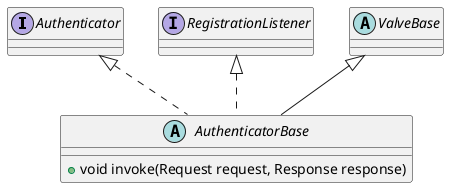

org.apache.catalina.authenticator.AuthenticatorBase

## hierarchy
```
LifecycleBase (org.apache.catalina.util)
    LifecycleMBeanBase (org.apache.catalina.util)
        ValveBase (org.apache.catalina.valves)
        AuthenticatorBase (org.apache.catalina.authenticator)
            FormAuthenticator (org.apache.catalina.authenticator)
            SpnegoAuthenticator (org.apache.catalina.authenticator)
            SSLAuthenticator (org.apache.catalina.authenticator)
            BasicAuthenticator (org.apache.catalina.authenticator)
            NonLoginAuthenticator (org.apache.catalina.authenticator)
            DigestAuthenticator (org.apache.catalina.authenticator)
```

## define

