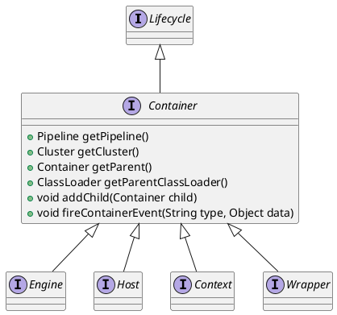

org.apache.catalina.Wrapper

## hierarchy
```
Wrapper (org.apache.catalina)
    StandardWrapper (org.apache.catalina.core)
        ExistingStandardWrapper in Tomcat (org.apache.catalina.startup)
Wrapper (org.apache.catalina)
    Container (org.apache.catalina)
        Lifecycle (org.apache.catalina)
```

## define


## fields


## methods