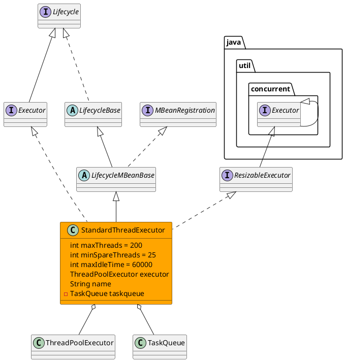

org.apache.catalina.core.StandardThreadExecutor
## hierarchy
```
LifecycleBase (org.apache.catalina.util)
    LifecycleMBeanBase (org.apache.catalina.util)
        StandardThreadExecutor (org.apache.catalina.core)
```
## define
