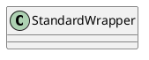

org.apache.catalina.core.StandardWrapper

## hierarchy
```
LifecycleBase (org.apache.catalina.util)
    LifecycleMBeanBase (org.apache.catalina.util)
        ContainerBase (org.apache.catalina.core)
            StandardWrapper (org.apache.catalina.core)
```

## define


## fields
```java
    private final ReentrantReadWriteLock parametersLock = new ReentrantReadWriteLock();
    private final ReentrantReadWriteLock mappingsLock = new ReentrantReadWriteLock();
    private final ReentrantReadWriteLock referencesLock = new ReentrantReadWriteLock();
```


## methods

### StandardWrapper
```java
    public StandardWrapper() {

        super();
        swValve=new StandardWrapperValve();
        pipeline.setBasic(swValve);
        broadcaster = new NotificationBroadcasterSupport();

    }
```