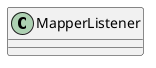

org.apache.catalina.mapper.MapperListener

## hierarchy
```
LifecycleBase (org.apache.catalina.util)
    LifecycleMBeanBase (org.apache.catalina.util)
        MapperListener (org.apache.catalina.mapper)
MapperListener (org.apache.catalina.mapper)
    LifecycleMBeanBase (org.apache.catalina.util)
        LifecycleBase (org.apache.catalina.util)
        JmxEnabled (org.apache.catalina)
        ContainerListener (org.apache.catalina)
        LifecycleListener (org.apache.catalina)
```

## define


## fields
```java
    // ----------------------------------------------------- Instance Variables
    private final Mapper mapper;
    private final Service service;
    private static final StringManager sm = StringManager.getManager(Constants.Package);
    private final String domain = null;
```

## methods