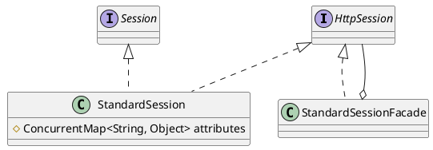

org.apache.catalina.session.StandardSession

## define

```plantuml
@startuml

interface HttpSession
interface Session

HttpSession ^.. StandardSession
Session ^.. StandardSession

class StandardSession {
    # ConcurrentMap<String, Object> attributes 
}

HttpSession ^.. StandardSessionFacade
class StandardSessionFacade
StandardSessionFacade o-- HttpSession

@enduml
```