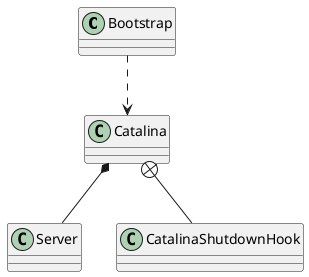

org.apache.catalina.startup.Catalina

## define


## methods

### start() 
* 加载
* 服务器启动，若启动失败则销毁
* 注册关闭钩子

```java
public void start() {

    if (getServer() == null) {
        load();
    }

    if (getServer() == null) {
        log.fatal("Cannot start server. Server instance is not configured.");
        return;
    }

    long t1 = System.nanoTime();

    // Start the new server
    try {
        getServer().start();
    } catch (LifecycleException e) {
        log.fatal(sm.getString("catalina.serverStartFail"), e);
        try {
            getServer().destroy();
        } catch (LifecycleException e1) {
            log.debug("destroy() failed for failed Server ", e1);
        }
        return;
    }

    long t2 = System.nanoTime();
    if(log.isInfoEnabled()) {
        log.info("Server startup in " + ((t2 - t1) / 1000000) + " ms");
    }

    // Register shutdown hook
    if (useShutdownHook) {
        if (shutdownHook == null) {
            shutdownHook = new CatalinaShutdownHook();
        }
        Runtime.getRuntime().addShutdownHook(shutdownHook);

        // If JULI is being used, disable JULI's shutdown hook since
        // shutdown hooks run in parallel and log messages may be lost
        // if JULI's hook completes before the CatalinaShutdownHook()
        LogManager logManager = LogManager.getLogManager();
        if (logManager instanceof ClassLoaderLogManager) {
            ((ClassLoaderLogManager) logManager).setUseShutdownHook(
                    false);
        }
    }

    if (await) {
        await();
        stop();
    }
}
```

### load()
* 初始化临时文件夹、命名服务
* 创建启动Digester，加载配置文件，解析
* 服务器初始化

```java
public void load() {

    if (loaded) {
        return;
    }
    loaded = true;

    long t1 = System.nanoTime();

    initDirs();

    // Before digester - it may be needed
    initNaming();

    // Create and execute our Digester
    Digester digester = createStartDigester();

    InputSource inputSource = null;
    InputStream inputStream = null;
    File file = null;
    try {
        try {
            file = configFile();
            inputStream = new FileInputStream(file);
            inputSource = new InputSource(file.toURI().toURL().toString());
        } catch (Exception e) {
            if (log.isDebugEnabled()) {
                log.debug(sm.getString("catalina.configFail", file), e);
            }
        }
        if (inputStream == null) {
            try {
                inputStream = getClass().getClassLoader()
                    .getResourceAsStream(getConfigFile());
                inputSource = new InputSource
                    (getClass().getClassLoader()
                     .getResource(getConfigFile()).toString());
            } catch (Exception e) {
                if (log.isDebugEnabled()) {
                    log.debug(sm.getString("catalina.configFail",
                            getConfigFile()), e);
                }
            }
        }

        // This should be included in catalina.jar
        // Alternative: don't bother with xml, just create it manually.
        if (inputStream == null) {
            try {
                inputStream = getClass().getClassLoader()
                        .getResourceAsStream("server-embed.xml");
                inputSource = new InputSource
                (getClass().getClassLoader()
                        .getResource("server-embed.xml").toString());
            } catch (Exception e) {
                if (log.isDebugEnabled()) {
                    log.debug(sm.getString("catalina.configFail",
                            "server-embed.xml"), e);
                }
            }
        }


        if (inputStream == null || inputSource == null) {
            if  (file == null) {
                log.warn(sm.getString("catalina.configFail",
                        getConfigFile() + "] or [server-embed.xml]"));
            } else {
                log.warn(sm.getString("catalina.configFail",
                        file.getAbsolutePath()));
                if (file.exists() && !file.canRead()) {
                    log.warn("Permissions incorrect, read permission is not allowed on the file.");
                }
            }
            return;
        }

        try {
            inputSource.setByteStream(inputStream);
            digester.push(this);
            digester.parse(inputSource);
        } catch (SAXParseException spe) {
            log.warn("Catalina.start using " + getConfigFile() + ": " +
                    spe.getMessage());
            return;
        } catch (Exception e) {
            log.warn("Catalina.start using " + getConfigFile() + ": " , e);
            return;
        }
    } finally {
        if (inputStream != null) {
            try {
                inputStream.close();
            } catch (IOException e) {
                // Ignore
            }
        }
    }

    getServer().setCatalina(this);
    getServer().setCatalinaHome(Bootstrap.getCatalinaHomeFile());
    getServer().setCatalinaBase(Bootstrap.getCatalinaBaseFile());

    // Stream redirection
    initStreams();

    // Start the new server
    try {
        getServer().init();
    } catch (LifecycleException e) {
        if (Boolean.getBoolean("org.apache.catalina.startup.EXIT_ON_INIT_FAILURE")) {
            throw new java.lang.Error(e);
        } else {
            log.error("Catalina.start", e);
        }
    }

    long t2 = System.nanoTime();
    if(log.isInfoEnabled()) {
        log.info("Initialization processed in " + ((t2 - t1) / 1000000) + " ms");
    }
}
```