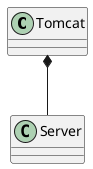

org.apache.catalina.startup.Tomcat


## define


## methods

### init()
```java
public void init() throws LifecycleException {
    getServer();
    getConnector();
    server.init();
}
```

### start()
```java
public void start() throws LifecycleException {
    getServer();
    getConnector();
    server.start();
}

```

### stop()
```java
public void stop() throws LifecycleException {
    getServer();
    server.stop();
}
```

### getServer()
```java
public Server getServer() {

    if (server != null) {
        return server;
    }

    System.setProperty("catalina.useNaming", "false");

    server = new StandardServer();

    initBaseDir();

    server.setPort( -1 );

    Service service = new StandardService();
    service.setName("Tomcat");
    server.addService(service);
    return server;
}
```

### getConnector()
```java
public Connector getConnector() {
    Service service = getService();
    if (service.findConnectors().length > 0) {
        return service.findConnectors()[0];
    }

    if (defaultConnectorCreated) {
        return null;
    }
    // The same as in standard Tomcat configuration.
    // This creates an APR HTTP connector if AprLifecycleListener has been
    // configured (created) and Tomcat Native library is available.
    // Otherwise it creates a NIO HTTP connector.
    Connector connector = new Connector("HTTP/1.1");
    connector.setPort(port);
    service.addConnector(connector);
    defaultConnectorCreated = true;
    return connector;
}
```