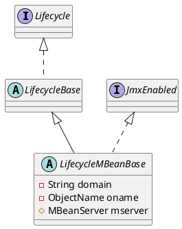

org.apache.catalina.util.LifecycleMBeanBase

## define

```plantuml
@startuml

interface Lifecycle
interface JmxEnabled

abstract class LifecycleBase {
}

abstract class LifecycleMBeanBase {
    - String domain
    - ObjectName oname
    # MBeanServer mserver
}

Lifecycle <|.. LifecycleBase
LifecycleBase <|-- LifecycleMBeanBase
JmxEnabled <|.. LifecycleMBeanBase

@enduml
```
