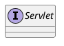

## hierarchy
```
Servlet (javax.servlet)
    GenericServlet (javax.servlet)
        GenericServletAdapter in FreeMarkerView (org.springframework.web.servlet.view.freemarker)
        HttpServlet (javax.servlet.http)
            // tomcat
            DefaultServlet (org.apache.catalina.servlets)
            HostManagerServlet (org.apache.catalina.manager.host)
            ManagerServlet (org.apache.catalina.manager)
            JMXProxyServlet (org.apache.catalina.manager)
            StatusManagerServlet (org.apache.catalina.manager)
            SSIServlet (org.apache.catalina.ssi)
            CGIServlet (org.apache.catalina.servlets)
            // spring
            HttpServletBean (org.springframework.web.servlet)
                FrameworkServlet (org.springframework.web.servlet)
                    DispatcherServlet (org.springframework.web.servlet)
            LiveBeansViewServlet (org.springframework.web.context.support)
            HttpRequestHandlerServlet (org.springframework.web.context.support)
            // undertow
            WebSocketServlet (io.undertow.servlet.websockets)
            DefaultServlet (io.undertow.servlet.handlers)
            FreemarkerServlet (freemarker.ext.servlet)
            // alibaba
            DispatcherServlet (com.alibaba.dubbo.remoting.http.servlet)
            PageServlet (com.alibaba.dubbo.container.page)
            ResourceServlet (com.alibaba.druid.support.http)
    ServletHttpHandlerAdapter (org.springframework.http.server.reactive)
        JettyHttpHandlerAdapter (org.springframework.http.server.reactive)
        TomcatHttpHandlerAdapter (org.springframework.http.server.reactive)
```

## define


```java
public interface Servlet {
    public void init(ServletConfig config) throws ServletException;
    public ServletConfig getServletConfig();
    public void service(ServletRequest req, ServletResponse res)
            throws ServletException, IOException;
    public String getServletInfo();
    public void destroy();
}

```


## fields

## methods

## yuml
```yuml
// {type:class}

// 1. Servlet
[Servlet{bg:wheat}]
[GenericServlet{bg:wheat}]
[HttpServlet{bg:wheat}]

// 1.1 Servlet的实现
[Servlet]^-.-[GenericServlet]
[ServletConfig]^-.-[GenericServlet]
[GenericServlet]++-[ServletConfig]

// 1.2 servlet接口、配置、上下文
[Servlet]++-[ServletConfig]
[ServletConfig]++-[ServletContext]

// 1.3 请求-响应模型
[ServletRequest]++-[AsyncContext]
[ServletRequest]++-[ServletContext]
[ServletRequest]++-[RequestDispatcher]
[ServletRequest]++-[DispatcherType]

[ServletResponse]

// 1.4 http协议的servlet
[GenericServlet]^-[HttpServlet]

// 依赖
[Servlet]uses->[ServletRequest]
[Servlet]uses->[ServletResponse]

// 2. 事件
[ServletContextListener]uses->[ServletContextEvent]
[ServletContextEvent]uses->[ServletContext]


// 3. Filter
[Filter]
[FilterChain]
[FilterConfig]++-[ServletContext]

// 3.1 注册表
[Registration]^-[FilterRegistration]

// 依赖
[Filter]uses->[FilterConfig]
[Filter]uses->[ServletRequest]
[Filter]uses->[ServletResponse]
[FilterChain]uses->[ServletRequest]
[FilterChain]uses->[ServletResponse]

```