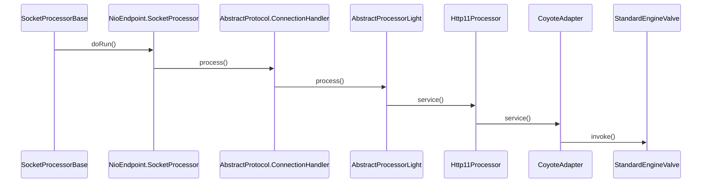
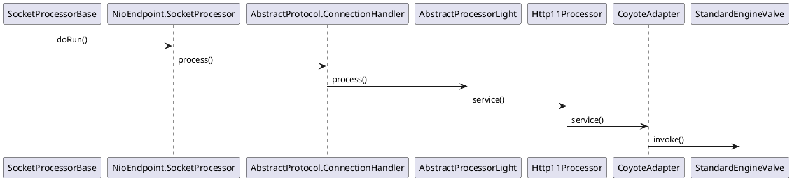

org.apache.tomcat.util.net.SocketProcessorBase

## hierarchy

```
SocketProcessorBase (org.apache.tomcat.util.net)
    SocketProcessor in AprEndpoint (org.apache.tomcat.util.net)
    SocketProcessor in Nio2Endpoint (org.apache.tomcat.util.net)
    SocketProcessor in NioEndpoint (org.apache.tomcat.util.net)
```


## SocketProcessorBase.run()



## seq

